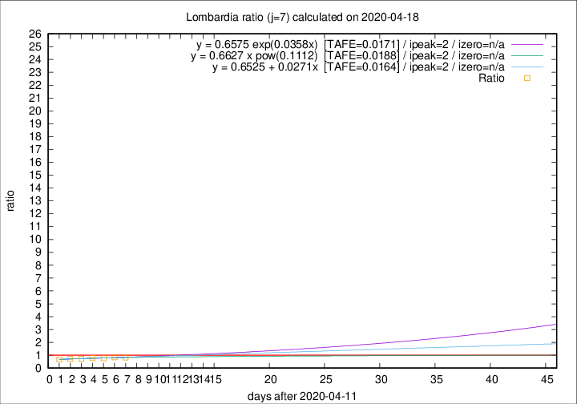
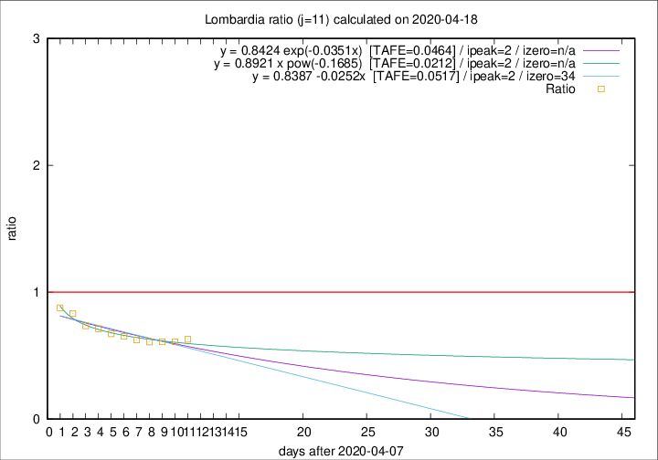

# Lombardia

Data source: https://raw.githubusercontent.com/pcm-dpc/COVID-19/master/dati-json/dpc-covid19-ita-regioni.json

Estimates in this page were made on 19/4/2020 with data available until 18/04/2020.

## Summary 

### Peak estimate 
|j|linear [TAFE]|exponential [TAFE]|power law [TAFE]|details|
|---|----|-----------|---------|-------|
|7|14/4/2020 [TAFE=0.0164]|14/4/2020 [TAFE=0.0171]|14/4/2020 [TAFE=0.0188]|[analysis](COVID-19_lombardia_j7_2020-04-18.md)|
|8|13/4/2020 [TAFE=0.0199]|13/4/2020 [TAFE=0.0186]|13/4/2020 [TAFE=0.0313]|[analysis](COVID-19_lombardia_j8_2020-04-18.md)|
|9|12/4/2020 [TAFE=0.0522]|12/4/2020 [TAFE=0.0514]|12/4/2020 [TAFE=0.0576]|[analysis](COVID-19_lombardia_j9_2020-04-18.md)|
|10|11/4/2020 [TAFE=0.0623]|11/4/2020 [TAFE=0.0619]|11/4/2020 [TAFE=0.0497]|[analysis](COVID-19_lombardia_j10_2020-04-18.md)|
|11|10/4/2020 [TAFE=0.0517]|10/4/2020 [TAFE=0.0464]|10/4/2020 [TAFE=0.0212]|[analysis](COVID-19_lombardia_j11_2020-04-18.md)|
|12|9/4/2020 [TAFE=0.0873]|9/4/2020 [TAFE=0.0673]|9/4/2020 [TAFE=0.0258]|[analysis](COVID-19_lombardia_j12_2020-04-18.md)|
|13|12/4/2020 [TAFE=0.1133]|11/4/2020 [TAFE=0.0764]|10/4/2020 [TAFE=0.0575]|[analysis](COVID-19_lombardia_j13_2020-04-18.md)|
|14|13/4/2020 [TAFE=0.0962]|12/4/2020 [TAFE=0.0528]|11/4/2020 [TAFE=0.0890]|[analysis](COVID-19_lombardia_j14_2020-04-18.md)|

Best estimator is linear with j=7 (TAFE=0.0164)
Corresponding peak date estimate is 14/4/2020 (ipeak 2)

Peak date range estimate: 14/4/2020 - 20/4/2020

### End estimate 
|j|linear [TAFE/TFE]|exponential [TAFE/TFE]|power law [TAFE/TFE]|details|
|---|----|-----------|---------|-------|
|7|-|-|-|[analysis](COVID-19_lombardia_j7_2020-04-18.md)|
|8|-|-|-|[analysis](COVID-19_lombardia_j8_2020-04-18.md)|
|9|-|-|-|[analysis](COVID-19_lombardia_j9_2020-04-18.md)|
|10|28/6/2020 [TAFE=0.0623]|-|-|[analysis](COVID-19_lombardia_j10_2020-04-18.md)|
|11|12/5/2020 [TAFE=0.0517]|-|-|[analysis](COVID-19_lombardia_j11_2020-04-18.md)|
|12|-|-|-|[analysis](COVID-19_lombardia_j12_2020-04-18.md)|
|13|-|-|-|[analysis](COVID-19_lombardia_j13_2020-04-18.md)|
|14|-|-|-|[analysis](COVID-19_lombardia_j14_2020-04-18.md)|

Best estimator is linear with j=11 (TAFE=0.0517)
Corresponding end date estimate is 12/5/2020 (izero 34)

End date range estimate: 8/4/2020 - 27/6/2020

Generated April 19th, 2020 at 18:42:39 UTC+0200 with https://github.com/robianc/COVID-19
