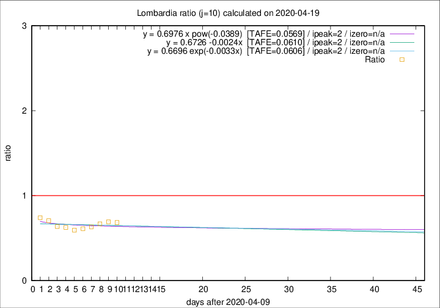

# Lombardia

Data source: https://raw.githubusercontent.com/pcm-dpc/COVID-19/master/dati-json/dpc-covid19-ita-regioni.json

Delta days analysis (j): 10

Analyses for other values of j for 2020-04-19 are avalable [here](../2020-04-19/README.md)

Analyses for Lombardia for previous dates are avalable [here](../README.md)

## Fitting 
|fit type|best fit equation|tafe|tfe|ipeak|izero|
|-------|-----|--------|------|---|---|
|linear|y = 0.6726 -0.0024x  [TAFE=0.0610]|0.0610|0.0046|2|n/a|
|exp|y = 0.6696 exp(-0.0033x)  [TAFE=0.0606]|0.0606|0.0018|2|n/a|
|pow|y = 0.6976 x pow(-0.0389)  [TAFE=0.0569]|0.0569|0.0019|2|n/a|

## Data
|Date|Daily deaths|Cumulated deaths|Deaths in the last 10 days|Deaths in the 10 days before|ratio|
|----|----------|-----------|-------|--------------------|-----|
|2020-04-19|163|12213|2191|3204|0.6838|
|2020-04-18|199|12050|2328|3362|0.6924|
|2020-04-17|243|11851|2367|3540|0.6686|
|2020-04-16|231|11608|2406|3800|0.6332|
|2020-04-15|235|11377|2472|4044|0.6113|
|2020-04-14|241|11142|2486|4182|0.5945|
|2020-04-13|280|10901|2590|4133|0.6267|
|2020-04-12|110|10621|2661|4184|0.6360|
|2020-04-11|273|10511|2918|4137|0.7053|
|2020-04-10|216|10238|3039|4104|0.7405|

[Download data as CSV](COVID-19_lombardia_j10_2020-04-19.csv)

Generated April 19th, 2020 at 18:42:39 UTC+0200 with https://github.com/robianc/COVID-19
