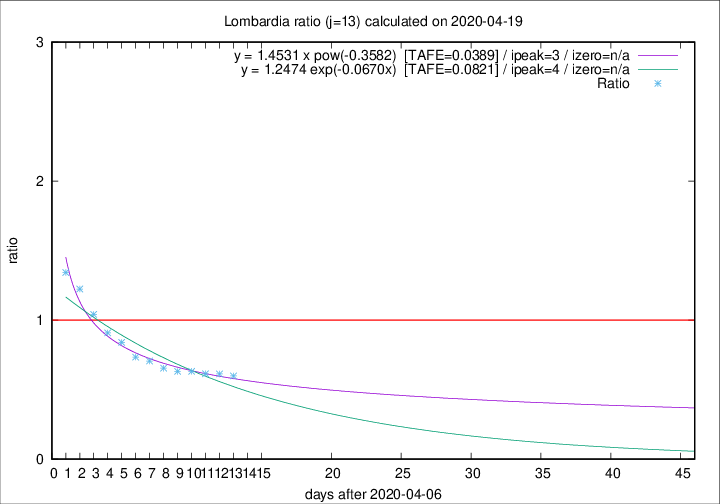

# Lombardia

Data source: https://raw.githubusercontent.com/pcm-dpc/COVID-19/master/dati-json/dpc-covid19-ita-regioni.json

Delta days analysis (j): 13

Analyses for other values of j for 2020-04-19 are avalable [here](../2020-04-19/README.md)

Analyses for Lombardia for previous dates are avalable [here](../README.md)

## Fitting 
|fit type|best fit equation|tafe|tfe|ipeak|izero|
|-------|-----|--------|------|---|---|
|exp|y = 1.2474 exp(-0.0670x)  [TAFE=0.0821]|0.0821|0.0040|4|n/a|
|pow|y = 1.4531 x pow(-0.3582)  [TAFE=0.0389]|0.0389|0.0009|3|n/a|

## Data
|Date|Daily deaths|Cumulated deaths|Deaths in the last 13 days|Deaths in the 13 days before|ratio|
|----|----------|-----------|-------|--------------------|-----|
|2020-04-19|163|12213|3011|5024|0.5993|
|2020-04-18|199|12050|3145|5129|0.6132|
|2020-04-17|243|11851|3195|5200|0.6144|
|2020-04-16|231|11608|3297|5216|0.6321|
|2020-04-15|235|11377|3417|5411|0.6315|
|2020-04-14|241|11142|3549|5425|0.6542|
|2020-04-13|280|10901|3702|5240|0.7065|
|2020-04-12|110|10621|3803|5178|0.7345|
|2020-04-11|273|10511|4151|4940|0.8403|
|2020-04-10|216|10238|4294|4726|0.9086|
|2020-04-09|300|10022|4620|4436|1.0415|
|2020-04-08|238|9722|4861|3971|1.2241|
|2020-04-07|282|9484|5010|3730|1.3432|

[Download data as CSV](COVID-19_lombardia_j13_2020-04-19.csv)

Generated April 19th, 2020 at 18:42:39 UTC+0200 with https://github.com/robianc/COVID-19
