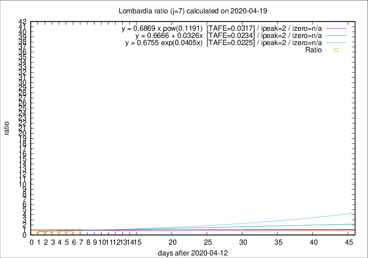

# Lombardia

Data source: https://raw.githubusercontent.com/pcm-dpc/COVID-19/master/dati-json/dpc-covid19-ita-regioni.json

Delta days analysis (j): 7

Analyses for other values of j for 2020-04-19 are avalable [here](../2020-04-19/README.md)

Analyses for Lombardia for previous dates are avalable [here](../README.md)

## Fitting 
|fit type|best fit equation|tafe|tfe|ipeak|izero|
|-------|-----|--------|------|---|---|
|linear|y = 0.6666 + 0.0326x  [TAFE=0.0234]|0.0234|0.0006|2|n/a|
|exp|y = 0.6755 exp(0.0405x)  [TAFE=0.0225]|0.0225|0.0005|2|n/a|
|pow|y = 0.6869 x pow(0.1191)  [TAFE=0.0317]|0.0317|0.0007|2|n/a|

## Data
|Date|Daily deaths|Cumulated deaths|Deaths in the last 7 days|Deaths in the 7 days before|ratio|
|----|----------|-----------|-------|--------------------|-----|
|2020-04-19|163|12213|1592|1716|0.9277|
|2020-04-18|199|12050|1539|1855|0.8296|
|2020-04-17|243|11851|1613|1927|0.8371|
|2020-04-16|231|11608|1586|2062|0.7692|
|2020-04-15|235|11377|1655|2129|0.7774|
|2020-04-14|241|11142|1658|2285|0.7256|
|2020-04-13|280|10901|1699|2384|0.7127|

[Download data as CSV](COVID-19_lombardia_j7_2020-04-19.csv)

Generated April 19th, 2020 at 18:42:39 UTC+0200 with https://github.com/robianc/COVID-19
