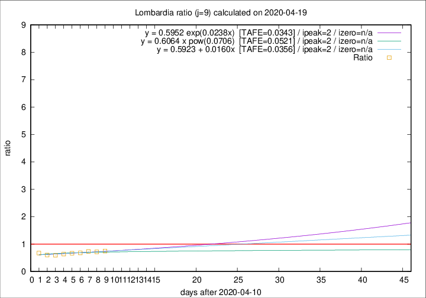

# Lombardia

Data source: https://raw.githubusercontent.com/pcm-dpc/COVID-19/master/dati-json/dpc-covid19-ita-regioni.json

Delta days analysis (j): 9

Analyses for other values of j for 2020-04-19 are avalable [here](../2020-04-19/README.md)

Analyses for Lombardia for previous dates are avalable [here](../README.md)

## Fitting 
|fit type|best fit equation|tafe|tfe|ipeak|izero|
|-------|-----|--------|------|---|---|
|linear|y = 0.5923 + 0.0160x  [TAFE=0.0356]|0.0356|0.0020|2|n/a|
|exp|y = 0.5952 exp(0.0238x)  [TAFE=0.0343]|0.0343|0.0010|2|n/a|
|pow|y = 0.6064 x pow(0.0706)  [TAFE=0.0521]|0.0521|0.0018|2|n/a|

## Data
|Date|Daily deaths|Cumulated deaths|Deaths in the last 9 days|Deaths in the 9 days before|ratio|
|----|----------|-----------|-------|--------------------|-----|
|2020-04-19|163|12213|1975|2645|0.7467|
|2020-04-18|199|12050|2028|2823|0.7184|
|2020-04-17|243|11851|2129|2904|0.7331|
|2020-04-16|231|11608|2124|3124|0.6799|
|2020-04-15|235|11377|2175|3258|0.6676|
|2020-04-14|241|11142|2237|3503|0.6386|
|2020-04-13|280|10901|2245|3795|0.5916|
|2020-04-12|110|10621|2310|3837|0.6020|
|2020-04-11|273|10511|2551|3782|0.6745|

[Download data as CSV](COVID-19_lombardia_j9_2020-04-19.csv)

Generated April 19th, 2020 at 18:42:39 UTC+0200 with https://github.com/robianc/COVID-19
