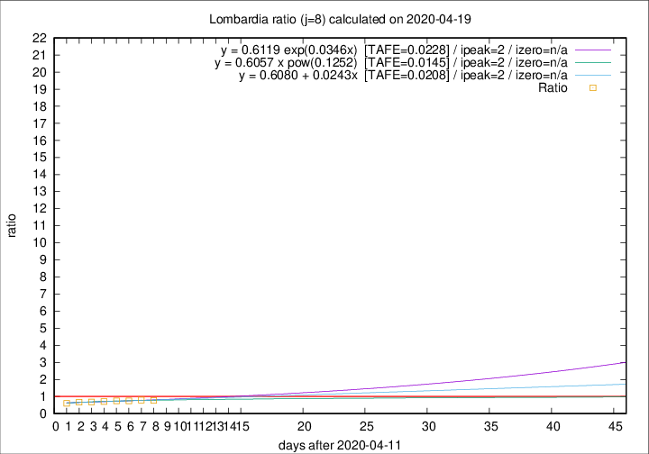
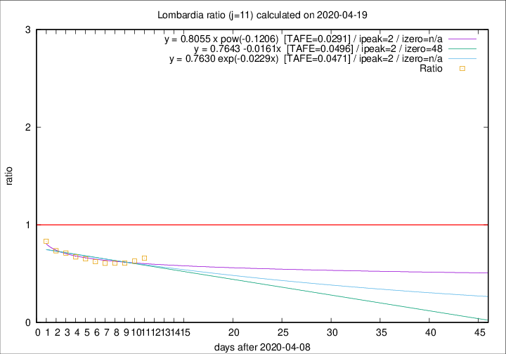

# Lombardia

Data source: https://raw.githubusercontent.com/pcm-dpc/COVID-19/master/dati-json/dpc-covid19-ita-regioni.json

Estimates in this page were made on 19/4/2020 with data available until 19/04/2020.

## Summary 

### Peak estimate 
|j|linear [TAFE]|exponential [TAFE]|power law [TAFE]|details|
|---|----|-----------|---------|-------|
|7|15/4/2020 [TAFE=0.0234]|15/4/2020 [TAFE=0.0225]|15/4/2020 [TAFE=0.0317]|[analysis](COVID-19_lombardia_j7_2020-04-19.md)|
|8|14/4/2020 [TAFE=0.0208]|14/4/2020 [TAFE=0.0228]|14/4/2020 [TAFE=0.0145]|[analysis](COVID-19_lombardia_j8_2020-04-19.md)|
|9|13/4/2020 [TAFE=0.0356]|13/4/2020 [TAFE=0.0343]|13/4/2020 [TAFE=0.0521]|[analysis](COVID-19_lombardia_j9_2020-04-19.md)|
|10|12/4/2020 [TAFE=0.0610]|12/4/2020 [TAFE=0.0606]|12/4/2020 [TAFE=0.0569]|[analysis](COVID-19_lombardia_j10_2020-04-19.md)|
|11|11/4/2020 [TAFE=0.0496]|11/4/2020 [TAFE=0.0471]|11/4/2020 [TAFE=0.0291]|[analysis](COVID-19_lombardia_j11_2020-04-19.md)|
|12|10/4/2020 [TAFE=0.0710]|10/4/2020 [TAFE=0.0581]|10/4/2020 [TAFE=0.0213]|[analysis](COVID-19_lombardia_j12_2020-04-19.md)|
|13|11/4/2020 [TAFE=0.1117]|11/4/2020 [TAFE=0.0821]|10/4/2020 [TAFE=0.0389]|[analysis](COVID-19_lombardia_j13_2020-04-19.md)|
|14|13/4/2020 [TAFE=0.1142]|12/4/2020 [TAFE=0.0704]|11/4/2020 [TAFE=0.0684]|[analysis](COVID-19_lombardia_j14_2020-04-19.md)|

Best estimator is pow with j=8 (TAFE=0.0145)
Corresponding peak date estimate is 14/4/2020 (ipeak 2)

Peak date range estimate: 14/4/2020 - 19/4/2020

### End estimate 
|j|linear [TAFE/TFE]|exponential [TAFE/TFE]|power law [TAFE/TFE]|details|
|---|----|-----------|---------|-------|
|7|-|-|-|[analysis](COVID-19_lombardia_j7_2020-04-19.md)|
|8|-|-|-|[analysis](COVID-19_lombardia_j8_2020-04-19.md)|
|9|-|-|-|[analysis](COVID-19_lombardia_j9_2020-04-19.md)|
|10|-|-|-|[analysis](COVID-19_lombardia_j10_2020-04-19.md)|
|11|27/5/2020 [TAFE=0.0496]|-|-|[analysis](COVID-19_lombardia_j11_2020-04-19.md)|
|12|-|-|-|[analysis](COVID-19_lombardia_j12_2020-04-19.md)|
|13|-|-|-|[analysis](COVID-19_lombardia_j13_2020-04-19.md)|
|14|-|-|-|[analysis](COVID-19_lombardia_j14_2020-04-19.md)|

Best estimator is linear with j=11 (TAFE=0.0496)
Corresponding end date estimate is 27/5/2020 (izero 48)

End date range estimate: 9/4/2020 - 27/5/2020

Generated April 19th, 2020 at 18:42:39 UTC+0200 with https://github.com/robianc/COVID-19
