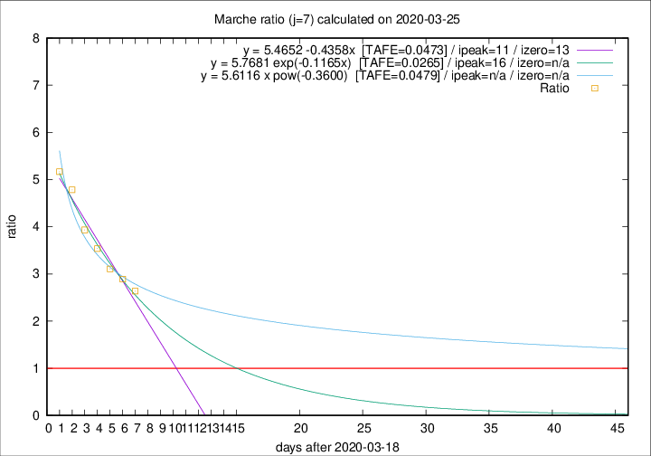

# Marche

Data source: https://raw.githubusercontent.com/pcm-dpc/COVID-19/master/dati-json/dpc-covid19-ita-regioni.json

Delta days analysis (j): 7

Analyses for other values of j for 2020-03-25 are avalable [here](../2020-03-25/README.md)

Analyses for Marche for previous dates are avalable [here](../README.md)

## Fitting 
|fit type|best fit equation|tafe|tfe|ipeak|izero|
|-------|-----|--------|------|---|---|
|linear|y = 5.4652 -0.4358x  [TAFE=0.0473]|0.0473|0.0003|11|13|
|exp|y = 5.7681 exp(-0.1165x)  [TAFE=0.0265]|0.0265|0.0004|16|n/a|
|pow|y = 5.6116 x pow(-0.3600)  [TAFE=0.0479]|0.0479|0.0015|n/a|n/a|

## Data
|Date|Daily deaths|Cumulated deaths|Deaths in the last 7 days|Deaths in the 7 days before|ratio|
|----|----------|-----------|-------|--------------------|-----|
|2020-03-25|56|287|195|74|2.6351|
|2020-03-24|28|231|162|56|2.8929|
|2020-03-23|19|203|146|47|3.1064|
|2020-03-22|30|184|138|39|3.5385|
|2020-03-21|17|154|118|30|3.9333|
|2020-03-20|22|137|110|23|4.7826|
|2020-03-19|23|115|93|18|5.1667|

[Download data as CSV](COVID-19_marche_j7_2020-03-25.csv)

Generated April 14th, 2020 at 19:16:04 UTC+0200 with https://github.com/robianc/COVID-19
