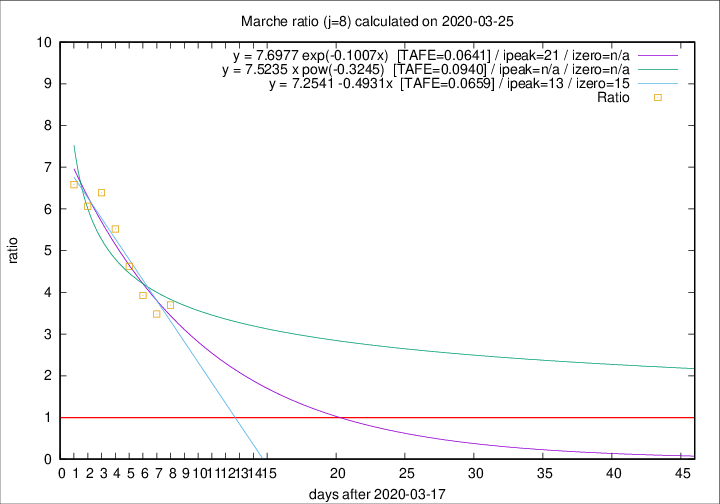

# Marche

Data source: https://raw.githubusercontent.com/pcm-dpc/COVID-19/master/dati-json/dpc-covid19-ita-regioni.json

Delta days analysis (j): 8

Analyses for other values of j for 2020-03-25 are avalable [here](../2020-03-25/README.md)

Analyses for Marche for previous dates are avalable [here](../README.md)

## Fitting 
|fit type|best fit equation|tafe|tfe|ipeak|izero|
|-------|-----|--------|------|---|---|
|linear|y = 7.2541 -0.4931x  [TAFE=0.0659]|0.0659|0.0049|13|15|
|exp|y = 7.6977 exp(-0.1007x)  [TAFE=0.0641]|0.0641|0.0025|21|n/a|
|pow|y = 7.5235 x pow(-0.3245)  [TAFE=0.0940]|0.0940|0.0063|n/a|n/a|

## Data
|Date|Daily deaths|Cumulated deaths|Deaths in the last 8 days|Deaths in the 8 days before|ratio|
|----|----------|-----------|-------|--------------------|-----|
|2020-03-25|56|287|218|59|3.6949|
|2020-03-24|28|231|174|50|3.4800|
|2020-03-23|19|203|157|40|3.9250|
|2020-03-22|30|184|148|32|4.6250|
|2020-03-21|17|154|127|23|5.5217|
|2020-03-20|22|137|115|18|6.3889|
|2020-03-19|23|115|97|16|6.0625|
|2020-03-18|23|92|79|12|6.5833|

[Download data as CSV](COVID-19_marche_j8_2020-03-25.csv)

Generated April 14th, 2020 at 19:16:04 UTC+0200 with https://github.com/robianc/COVID-19
