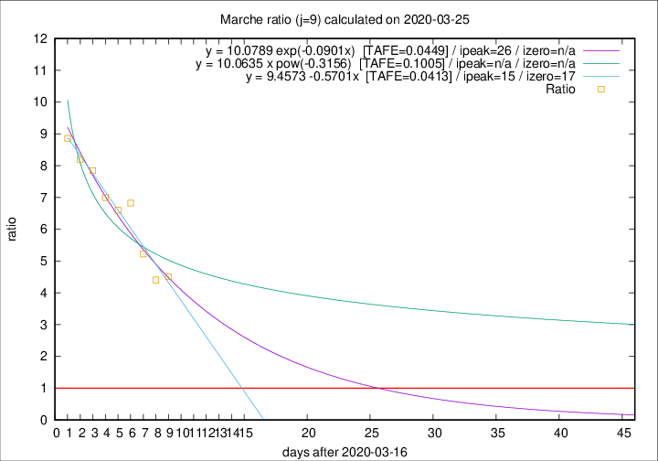

# Marche

Data source: https://raw.githubusercontent.com/pcm-dpc/COVID-19/master/dati-json/dpc-covid19-ita-regioni.json

Delta days analysis (j): 9

Analyses for other values of j for 2020-03-25 are avalable [here](../2020-03-25/README.md)

Analyses for Marche for previous dates are avalable [here](../README.md)

## Fitting 
|fit type|best fit equation|tafe|tfe|ipeak|izero|
|-------|-----|--------|------|---|---|
|linear|y = 9.4573 -0.5701x  [TAFE=0.0413]|0.0413|0.0038|15|17|
|exp|y = 10.0789 exp(-0.0901x)  [TAFE=0.0449]|0.0449|0.0020|26|n/a|
|pow|y = 10.0635 x pow(-0.3156)  [TAFE=0.1005]|0.1005|0.0063|n/a|n/a|

## Data
|Date|Daily deaths|Cumulated deaths|Deaths in the last 9 days|Deaths in the 9 days before|ratio|
|----|----------|-----------|-------|--------------------|-----|
|2020-03-25|56|287|230|51|4.5098|
|2020-03-24|28|231|185|42|4.4048|
|2020-03-23|19|203|167|32|5.2188|
|2020-03-22|30|184|157|23|6.8261|
|2020-03-21|17|154|132|20|6.6000|
|2020-03-20|22|137|119|17|7.0000|
|2020-03-19|23|115|102|13|7.8462|
|2020-03-18|23|92|82|10|8.2000|
|2020-03-17|12|69|62|7|8.8571|

[Download data as CSV](COVID-19_marche_j9_2020-03-25.csv)

Generated April 14th, 2020 at 19:16:04 UTC+0200 with https://github.com/robianc/COVID-19
