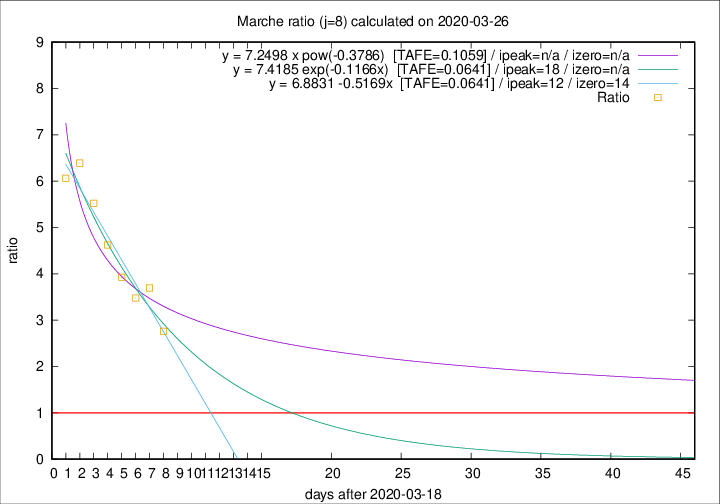

# Marche

Data source: https://raw.githubusercontent.com/pcm-dpc/COVID-19/master/dati-json/dpc-covid19-ita-regioni.json

Delta days analysis (j): 8

## Fitting 
|fit type|best fit equation|tafe|tfe|ipeak|izero|
|-------|-----|--------|------|---|---|
|linear|y = 6.8831 -0.5169x  [TAFE=0.0641]|0.0641|0.0042|12|14|
|exp|y = 7.4185 exp(-0.1166x)  [TAFE=0.0641]|0.0641|0.0026|18|n/a|
|pow|y = 7.2498 x pow(-0.3786)  [TAFE=0.1059]|0.1059|0.0073|n/a|n/a|

## Data
|Date|Daily deaths|Cumulated deaths|Deaths in the last 8 days|Deaths in the 8 days before|ratio|
|----|----------|-----------|-------|--------------------|-----|
|2020-03-26|23|310|218|79|2.7595|
|2020-03-25|56|287|218|59|3.6949|
|2020-03-24|28|231|174|50|3.4800|
|2020-03-23|19|203|157|40|3.9250|
|2020-03-22|30|184|148|32|4.6250|
|2020-03-21|17|154|127|23|5.5217|
|2020-03-20|22|137|115|18|6.3889|
|2020-03-19|23|115|97|16|6.0625|

[Download data as CSV](COVID-19_marche_j8_2020-03-26.csv)

Generated April 9th, 2020 at 16:40:48 UTC+0200 with https://github.com/robianc/COVID-19
