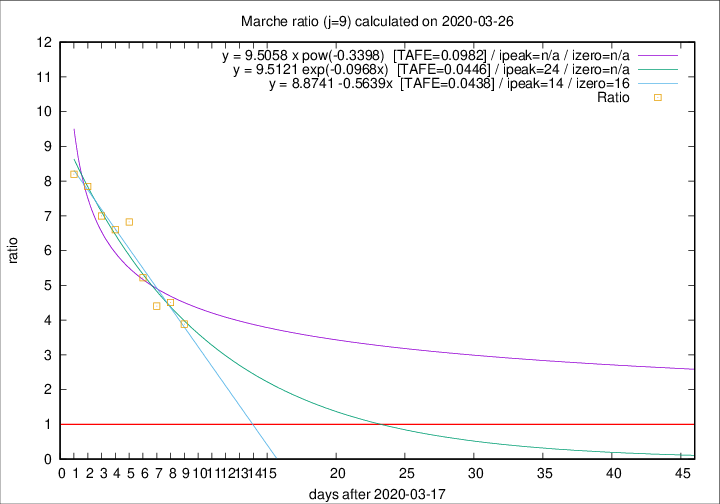

# Marche

Data source: https://raw.githubusercontent.com/pcm-dpc/COVID-19/master/dati-json/dpc-covid19-ita-regioni.json

Delta days analysis (j): 9

## Fitting 
|fit type|best fit equation|tafe|tfe|ipeak|izero|
|-------|-----|--------|------|---|---|
|linear|y = 8.8741 -0.5639x  [TAFE=0.0438]|0.0438|0.0035|14|16|
|exp|y = 9.5121 exp(-0.0968x)  [TAFE=0.0446]|0.0446|0.0020|24|n/a|
|pow|y = 9.5058 x pow(-0.3398)  [TAFE=0.0982]|0.0982|0.0067|n/a|n/a|

## Data
|Date|Daily deaths|Cumulated deaths|Deaths in the last 9 days|Deaths in the 9 days before|ratio|
|----|----------|-----------|-------|--------------------|-----|
|2020-03-26|23|310|241|62|3.8871|
|2020-03-25|56|287|230|51|4.5098|
|2020-03-24|28|231|185|42|4.4048|
|2020-03-23|19|203|167|32|5.2188|
|2020-03-22|30|184|157|23|6.8261|
|2020-03-21|17|154|132|20|6.6000|
|2020-03-20|22|137|119|17|7.0000|
|2020-03-19|23|115|102|13|7.8462|
|2020-03-18|23|92|82|10|8.2000|

[Download data as CSV](COVID-19_marche_j9_2020-03-26.csv)

Generated April 9th, 2020 at 16:40:48 UTC+0200 with https://github.com/robianc/COVID-19
