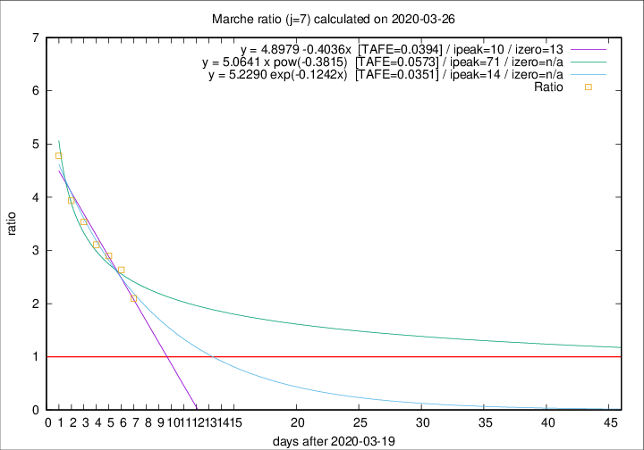

# Marche

Data source: https://raw.githubusercontent.com/pcm-dpc/COVID-19/master/dati-json/dpc-covid19-ita-regioni.json

Estimates in this page were made on 16/4/2020 with data available until 26/03/2020.

## Summary 

### Peak estimate 
|j|linear [TAFE]|exponential [TAFE]|power law [TAFE]|details|
|---|----|-----------|---------|-------|
|7|30/3/2020 [TAFE=0.0394]|3/4/2020 [TAFE=0.0351]|30/5/2020 [TAFE=0.0573]|[analysis](COVID-19_marche_j7_2020-03-26.md)|
|8|31/3/2020 [TAFE=0.0641]|6/4/2020 [TAFE=0.0641]|-|[analysis](COVID-19_marche_j8_2020-03-26.md)|
|9|1/4/2020 [TAFE=0.0438]|11/4/2020 [TAFE=0.0446]|-|[analysis](COVID-19_marche_j9_2020-03-26.md)|
|10|1/4/2020 [TAFE=0.0499]|13/4/2020 [TAFE=0.0604]|-|[analysis](COVID-19_marche_j10_2020-03-26.md)|
|11|-|-|-||
|12|-|-|-||
|13|-|-|-||
|14|-|-|-||

Best estimator is exp with j=7 (TAFE=0.0351)
Corresponding peak date estimate is 3/4/2020 (ipeak 14)

Peak date range estimate: 20/3/2020 - 30/5/2020

### End estimate 
|j|linear [TAFE/TFE]|exponential [TAFE/TFE]|power law [TAFE/TFE]|details|
|---|----|-----------|---------|-------|
|7|2/4/2020 [TAFE=0.0394]|-|-|[analysis](COVID-19_marche_j7_2020-03-26.md)|
|8|-|-|-|[analysis](COVID-19_marche_j8_2020-03-26.md)|
|9|-|-|-|[analysis](COVID-19_marche_j9_2020-03-26.md)|
|10|-|-|-|[analysis](COVID-19_marche_j10_2020-03-26.md)|
|11|-|-|-||
|12|-|-|-||
|13|-|-|-||
|14|-|-|-||

Best estimator is linear with j=7 (TAFE=0.0394)
Corresponding end date estimate is 2/4/2020 (izero 13)

End date range estimate: 20/3/2020 - 6/4/2020

Generated April 16th, 2020 at 20:09:19 UTC+0200 with https://github.com/robianc/COVID-19
