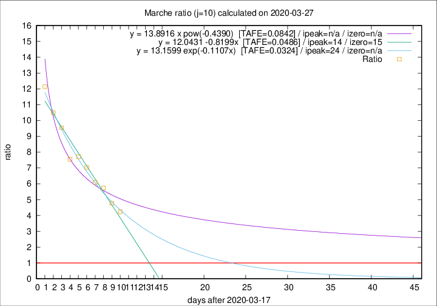

# Marche

Data source: https://raw.githubusercontent.com/pcm-dpc/COVID-19/master/dati-json/dpc-covid19-ita-regioni.json

Delta days analysis (j): 10

Analyses for other values of j for 2020-03-27 are avalable [here](../2020-03-27/README.md)

Analyses for Marche for previous dates are avalable [here](../README.md)

## Fitting 
|fit type|best fit equation|tafe|tfe|ipeak|izero|
|-------|-----|--------|------|---|---|
|linear|y = 12.0431 -0.8199x  [TAFE=0.0486]|0.0486|-0.0004|14|15|
|exp|y = 13.1599 exp(-0.1107x)  [TAFE=0.0324]|0.0324|0.0011|24|n/a|
|pow|y = 13.8916 x pow(-0.4390)  [TAFE=0.0842]|0.0842|0.0050|n/a|n/a|

## Data
|Date|Daily deaths|Cumulated deaths|Deaths in the last 10 days|Deaths in the 10 days before|ratio|
|----|----------|-----------|-------|--------------------|-----|
|2020-03-27|26|336|267|63|4.2381|
|2020-03-26|23|310|253|53|4.7736|
|2020-03-25|56|287|241|42|5.7381|
|2020-03-24|28|231|195|32|6.0938|
|2020-03-23|19|203|176|25|7.0400|
|2020-03-22|30|184|162|21|7.7143|
|2020-03-21|17|154|136|18|7.5556|
|2020-03-20|22|137|124|13|9.5385|
|2020-03-19|23|115|105|10|10.5000|
|2020-03-18|23|92|85|7|12.1429|

[Download data as CSV](COVID-19_marche_j10_2020-03-27.csv)

Generated April 16th, 2020 at 20:09:19 UTC+0200 with https://github.com/robianc/COVID-19
