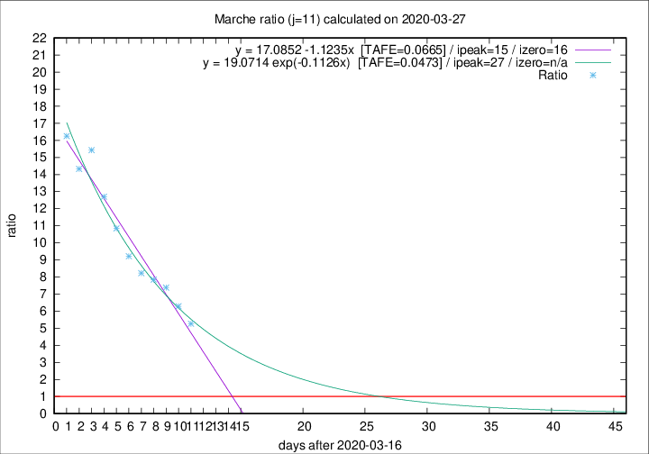

# Marche

Data source: https://raw.githubusercontent.com/pcm-dpc/COVID-19/master/dati-json/dpc-covid19-ita-regioni.json

Delta days analysis (j): 11

Analyses for other values of j for 2020-03-27 are avalable [here](../README.md)

Analyses for Marche for previous dates are avalable [here](../../README.md)

## Fitting 
|fit type|best fit equation|tafe|tfe|ipeak|izero|
|-------|-----|--------|------|---|---|
|linear|y = 17.0852 -1.1235x  [TAFE=0.0665]|0.0665|0.0003|15|16|
|exp|y = 19.0714 exp(-0.1126x)  [TAFE=0.0473]|0.0473|0.0015|27|n/a|

## Data
|Date|Daily deaths|Cumulated deaths|Deaths in the last 11 days|Deaths in the 11 days before|ratio|
|----|----------|-----------|-------|--------------------|-----|
|2020-03-27|26|336|279|53|5.2642|
|2020-03-26|23|310|264|42|6.2857|
|2020-03-25|56|287|251|34|7.3824|
|2020-03-24|28|231|204|26|7.8462|
|2020-03-23|19|203|181|22|8.2273|
|2020-03-22|30|184|166|18|9.2222|
|2020-03-21|17|154|141|13|10.8462|
|2020-03-20|22|137|127|10|12.7000|
|2020-03-19|23|115|108|7|15.4286|
|2020-03-18|23|92|86|6|14.3333|
|2020-03-17|12|69|65|4|16.2500|

[Download data as CSV](COVID-19_marche_j11_2020-03-27.csv)

Generated April 12th, 2020 at 16:28:18 UTC+0200 with https://github.com/robianc/COVID-19
