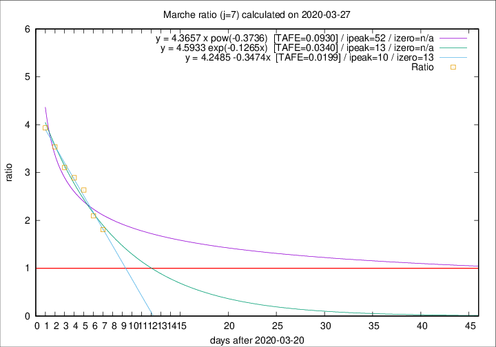

# Marche

Data source: https://raw.githubusercontent.com/pcm-dpc/COVID-19/master/dati-json/dpc-covid19-ita-regioni.json

Delta days analysis (j): 7

Analyses for other values of j for 2020-03-27 are avalable [here](../README.md)

Analyses for Marche for previous dates are avalable [here](../../README.md)

## Fitting 
|fit type|best fit equation|tafe|tfe|ipeak|izero|
|-------|-----|--------|------|---|---|
|linear|y = 4.2485 -0.3474x  [TAFE=0.0199]|0.0199|0.0008|10|13|
|exp|y = 4.5933 exp(-0.1265x)  [TAFE=0.0340]|0.0340|0.0007|13|n/a|
|pow|y = 4.3657 x pow(-0.3736)  [TAFE=0.0930]|0.0930|0.0049|52|n/a|

## Data
|Date|Daily deaths|Cumulated deaths|Deaths in the last 7 days|Deaths in the 7 days before|ratio|
|----|----------|-----------|-------|--------------------|-----|
|2020-03-27|26|336|199|110|1.8091|
|2020-03-26|23|310|195|93|2.0968|
|2020-03-25|56|287|195|74|2.6351|
|2020-03-24|28|231|162|56|2.8929|
|2020-03-23|19|203|146|47|3.1064|
|2020-03-22|30|184|138|39|3.5385|
|2020-03-21|17|154|118|30|3.9333|

[Download data as CSV](COVID-19_marche_j7_2020-03-27.csv)

Generated April 10th, 2020 at 17:26:10 UTC+0200 with https://github.com/robianc/COVID-19
