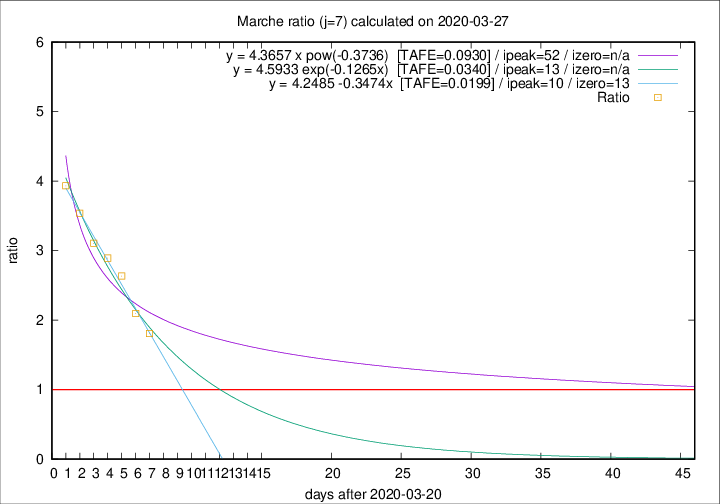

# Marche

Data source: https://raw.githubusercontent.com/pcm-dpc/COVID-19/master/dati-json/dpc-covid19-ita-regioni.json

Estimates in this page were made on 12/4/2020 with data available until 27/03/2020.

## Summary 

### Peak estimate 
|j|linear [TAFE]|exponential [TAFE]|power law [TAFE]|details|
|---|----|-----------|---------|-------|
|7|31/3/2020 [TAFE=0.0199]|3/4/2020 [TAFE=0.0340]|12/5/2020 [TAFE=0.0930]|[analysis](COVID-19_marche_j7_2020-03-27.md)|
|8|31/3/2020 [TAFE=0.0645]|4/4/2020 [TAFE=0.0452]|1/6/2020 [TAFE=0.0899]|[analysis](COVID-19_marche_j8_2020-03-27.md)|
|9|1/4/2020 [TAFE=0.0506]|8/4/2020 [TAFE=0.0610]|-|[analysis](COVID-19_marche_j9_2020-03-27.md)|
|10|1/4/2020 [TAFE=0.0486]|11/4/2020 [TAFE=0.0324]|-|[analysis](COVID-19_marche_j10_2020-03-27.md)|
|11|1/4/2020 [TAFE=0.0665]|13/4/2020 [TAFE=0.0473]|-|[analysis](COVID-19_marche_j11_2020-03-27.md)|
|12|-|-|-||
|13|-|-|-||
|14|-|-|-||

Best estimator is linear with j=7 (TAFE=0.0199)
Corresponding peak date estimate is 31/3/2020 (ipeak 10)

Peak date range estimate: 21/3/2020 - 2/6/2020

### End estimate 
|j|linear [TAFE/TFE]|exponential [TAFE/TFE]|power law [TAFE/TFE]|details|
|---|----|-----------|---------|-------|
|7|3/4/2020 [TAFE=0.0199]|-|-|[analysis](COVID-19_marche_j7_2020-03-27.md)|
|8|-|-|-|[analysis](COVID-19_marche_j8_2020-03-27.md)|
|9|-|-|-|[analysis](COVID-19_marche_j9_2020-03-27.md)|
|10|-|-|-|[analysis](COVID-19_marche_j10_2020-03-27.md)|
|11|-|-|-|[analysis](COVID-19_marche_j11_2020-03-27.md)|
|12|-|-|-||
|13|-|-|-||
|14|-|-|-||

Best estimator is linear with j=7 (TAFE=0.0199)
Corresponding end date estimate is 3/4/2020 (izero 13)

End date range estimate: 21/3/2020 - 6/4/2020

Generated April 12th, 2020 at 17:02:01 UTC+0200 with https://github.com/robianc/COVID-19
