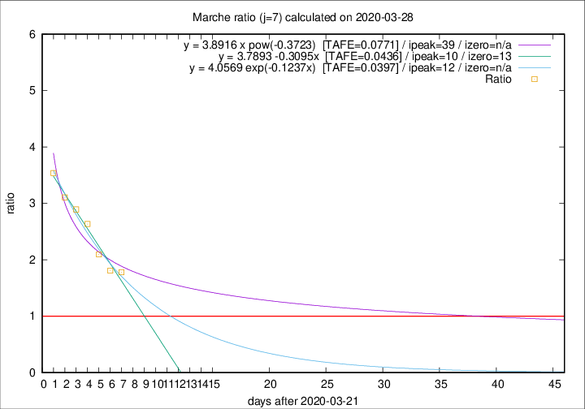

# Marche

Data source: https://raw.githubusercontent.com/pcm-dpc/COVID-19/master/dati-json/dpc-covid19-ita-regioni.json

Delta days analysis (j): 7

Analyses for other values of j for 2020-03-28 are avalable [here](../2020-03-28/README.md)

Analyses for Marche for previous dates are avalable [here](../README.md)

## Fitting 
|fit type|best fit equation|tafe|tfe|ipeak|izero|
|-------|-----|--------|------|---|---|
|linear|y = 3.7893 -0.3095x  [TAFE=0.0436]|0.0436|0.0015|10|13|
|exp|y = 4.0569 exp(-0.1237x)  [TAFE=0.0397]|0.0397|0.0012|12|n/a|
|pow|y = 3.8916 x pow(-0.3723)  [TAFE=0.0771]|0.0771|0.0037|39|n/a|

## Data
|Date|Daily deaths|Cumulated deaths|Deaths in the last 7 days|Deaths in the 7 days before|ratio|
|----|----------|-----------|-------|--------------------|-----|
|2020-03-28|28|364|210|118|1.7797|
|2020-03-27|26|336|199|110|1.8091|
|2020-03-26|23|310|195|93|2.0968|
|2020-03-25|56|287|195|74|2.6351|
|2020-03-24|28|231|162|56|2.8929|
|2020-03-23|19|203|146|47|3.1064|
|2020-03-22|30|184|138|39|3.5385|

[Download data as CSV](COVID-19_marche_j7_2020-03-28.csv)

Generated April 14th, 2020 at 19:16:04 UTC+0200 with https://github.com/robianc/COVID-19
