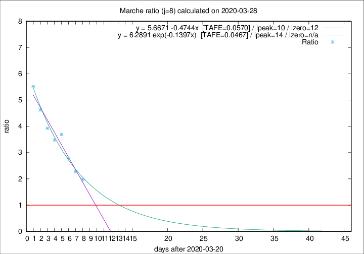

# Marche

Data source: https://raw.githubusercontent.com/pcm-dpc/COVID-19/master/dati-json/dpc-covid19-ita-regioni.json

Delta days analysis (j): 8

## Fitting 
|fit type|best fit equation|tafe|tfe|ipeak|izero|
|-------|-----|--------|------|---|---|
|linear|y = 5.6671 -0.4744x  [TAFE=0.0570]|0.0570|0.0021|10|12|
|exp|y = 6.2891 exp(-0.1397x)  [TAFE=0.0467]|0.0467|0.0023|14|n/a|

## Data
|Date|Daily deaths|Cumulated deaths|Deaths in the last 8 days|Deaths in the 8 days before|ratio|
|----|----------|-----------|-------|--------------------|-----|
|2020-03-28|28|364|227|115|1.9739|
|2020-03-27|26|336|221|97|2.2784|
|2020-03-26|23|310|218|79|2.7595|
|2020-03-25|56|287|218|59|3.6949|
|2020-03-24|28|231|174|50|3.4800|
|2020-03-23|19|203|157|40|3.9250|
|2020-03-22|30|184|148|32|4.6250|
|2020-03-21|17|154|127|23|5.5217|

[Download data as CSV](COVID-19_marche_j8_2020-03-28.csv)

Generated April 9th, 2020 at 16:40:48 UTC+0200 with https://github.com/robianc/COVID-19
