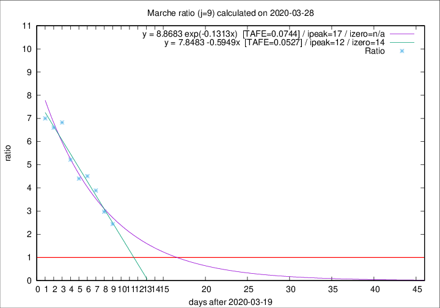

# Marche

Data source: https://raw.githubusercontent.com/pcm-dpc/COVID-19/master/dati-json/dpc-covid19-ita-regioni.json

Delta days analysis (j): 9

Analyses for other values of j for 2020-03-28 are avalable [here](../2020-03-28/README.md)

Analyses for Marche for previous dates are avalable [here](../README.md)

## Fitting 
|fit type|best fit equation|tafe|tfe|ipeak|izero|
|-------|-----|--------|------|---|---|
|linear|y = 7.8483 -0.5949x  [TAFE=0.0527]|0.0527|0.0049|12|14|
|exp|y = 8.8683 exp(-0.1313x)  [TAFE=0.0744]|0.0744|0.0035|17|n/a|

## Data
|Date|Daily deaths|Cumulated deaths|Deaths in the last 9 days|Deaths in the 9 days before|ratio|
|----|----------|-----------|-------|--------------------|-----|
|2020-03-28|28|364|249|102|2.4412|
|2020-03-27|26|336|244|82|2.9756|
|2020-03-26|23|310|241|62|3.8871|
|2020-03-25|56|287|230|51|4.5098|
|2020-03-24|28|231|185|42|4.4048|
|2020-03-23|19|203|167|32|5.2188|
|2020-03-22|30|184|157|23|6.8261|
|2020-03-21|17|154|132|20|6.6000|
|2020-03-20|22|137|119|17|7.0000|

[Download data as CSV](COVID-19_marche_j9_2020-03-28.csv)

Generated April 12th, 2020 at 17:02:01 UTC+0200 with https://github.com/robianc/COVID-19
