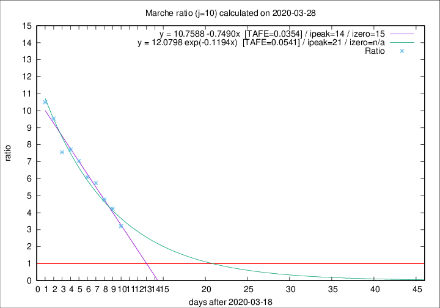

# Marche

Data source: https://raw.githubusercontent.com/pcm-dpc/COVID-19/master/dati-json/dpc-covid19-ita-regioni.json

Estimates in this page were made on 9/4/2020 with data available until 28/03/2020.

## Summary 

### Peak estimate 
|j|linear [TAFE]|exponential [TAFE]|power law [TAFE]|details|
|---|----|-----------|---------|-------|
|7|1/4/2020 [TAFE=0.0436]|3/4/2020 [TAFE=0.0397]|30/4/2020 [TAFE=0.0771]|[analysis](COVID-19_marche_j7_2020-03-28.md)|
|8|31/3/2020 [TAFE=0.0570]|4/4/2020 [TAFE=0.0467]|12/5/2020 [TAFE=0.0990]|[analysis](COVID-19_marche_j8_2020-03-28.md)|
|9|1/4/2020 [TAFE=0.0527]|6/4/2020 [TAFE=0.0744]|-|[analysis](COVID-19_marche_j9_2020-03-28.md)|
|10|2/4/2020 [TAFE=0.0354]|9/4/2020 [TAFE=0.0541]|-|[analysis](COVID-19_marche_j10_2020-03-28.md)|
|11|1/4/2020 [TAFE=0.0679]|12/4/2020 [TAFE=0.0494]|-|[analysis](COVID-19_marche_j11_2020-03-28.md)|
|12|-|-|-||
|13|-|-|-||
|14|-|-|-||

Best estimator is linear with j=10 (TAFE=0.0354)
Corresponding peak date estimate is 2/4/2020 (ipeak 14)

Peak date range estimate: 19/3/2020 - 10/5/2020

### End estimate 
|j|linear [TAFE/TFE]|exponential [TAFE/TFE]|power law [TAFE/TFE]|details|
|---|----|-----------|---------|-------|
|7|4/4/2020 [TAFE=0.0436]|-|-|[analysis](COVID-19_marche_j7_2020-03-28.md)|
|8|-|-|-|[analysis](COVID-19_marche_j8_2020-03-28.md)|
|9|-|-|-|[analysis](COVID-19_marche_j9_2020-03-28.md)|
|10|3/4/2020 [TAFE=0.0354]|-|-|[analysis](COVID-19_marche_j10_2020-03-28.md)|
|11|-|-|-|[analysis](COVID-19_marche_j11_2020-03-28.md)|
|12|-|-|-||
|13|-|-|-||
|14|-|-|-||

Best estimator is linear with j=10 (TAFE=0.0354)
Corresponding end date estimate is 3/4/2020 (izero 15)

End date range estimate: 19/3/2020 - 3/4/2020

Generated April 9th, 2020 at 16:40:48 UTC+0200 with https://github.com/robianc/COVID-19
