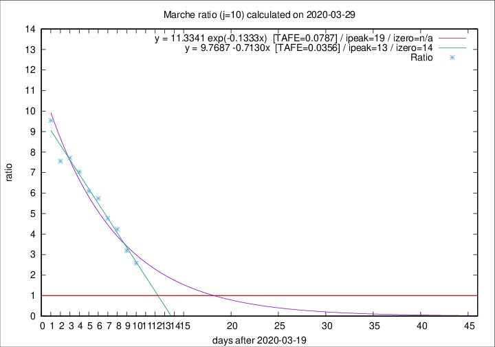

# Marche

Data source: https://raw.githubusercontent.com/pcm-dpc/COVID-19/master/dati-json/dpc-covid19-ita-regioni.json

Estimates in this page were made on 10/4/2020 with data available until 29/03/2020.

## Summary 

### Peak estimate 
|j|linear [TAFE]|exponential [TAFE]|power law [TAFE]|details|
|---|----|-----------|---------|-------|
|7|1/4/2020 [TAFE=0.0460]|3/4/2020 [TAFE=0.0401]|18/4/2020 [TAFE=0.0770]|[analysis](COVID-19_marche_j7_2020-03-29.md)|
|8|1/4/2020 [TAFE=0.0624]|4/4/2020 [TAFE=0.0460]|3/5/2020 [TAFE=0.1034]|[analysis](COVID-19_marche_j8_2020-03-29.md)|
|9|1/4/2020 [TAFE=0.0611]|5/4/2020 [TAFE=0.0686]|20/5/2020 [TAFE=0.1548]|[analysis](COVID-19_marche_j9_2020-03-29.md)|
|10|2/4/2020 [TAFE=0.0356]|8/4/2020 [TAFE=0.0787]|-|[analysis](COVID-19_marche_j10_2020-03-29.md)|
|11|1/4/2020 [TAFE=0.0729]|10/4/2020 [TAFE=0.0578]|-|[analysis](COVID-19_marche_j11_2020-03-29.md)|
|12|-|-|-||
|13|-|-|-||
|14|-|-|-||

Best estimator is linear with j=10 (TAFE=0.0356)
Corresponding peak date estimate is 2/4/2020 (ipeak 13)

Peak date range estimate: 20/3/2020 - 19/5/2020

### End estimate 
|j|linear [TAFE/TFE]|exponential [TAFE/TFE]|power law [TAFE/TFE]|details|
|---|----|-----------|---------|-------|
|7|4/4/2020 [TAFE=0.0460]|-|-|[analysis](COVID-19_marche_j7_2020-03-29.md)|
|8|-|-|-|[analysis](COVID-19_marche_j8_2020-03-29.md)|
|9|-|-|-|[analysis](COVID-19_marche_j9_2020-03-29.md)|
|10|3/4/2020 [TAFE=0.0356]|-|-|[analysis](COVID-19_marche_j10_2020-03-29.md)|
|11|-|-|-|[analysis](COVID-19_marche_j11_2020-03-29.md)|
|12|-|-|-||
|13|-|-|-||
|14|-|-|-||

Best estimator is linear with j=10 (TAFE=0.0356)
Corresponding end date estimate is 3/4/2020 (izero 14)

End date range estimate: 20/3/2020 - 3/4/2020

Generated April 10th, 2020 at 17:26:10 UTC+0200 with https://github.com/robianc/COVID-19
