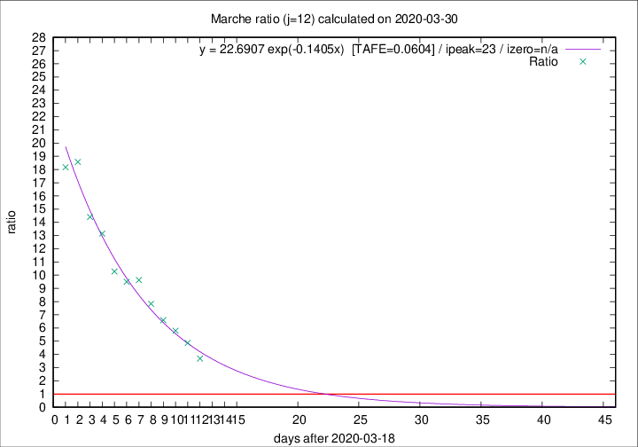

# Marche

Data source: https://raw.githubusercontent.com/pcm-dpc/COVID-19/master/dati-json/dpc-covid19-ita-regioni.json

Delta days analysis (j): 12

Analyses for other values of j for 2020-03-30 are avalable [here](../2020-03-30/README.md)

Analyses for Marche for previous dates are avalable [here](../README.md)

## Fitting 
|fit type|best fit equation|tafe|tfe|ipeak|izero|
|-------|-----|--------|------|---|---|
|exp|y = 22.6907 exp(-0.1405x)  [TAFE=0.0604]|0.0604|0.0028|23|n/a|

## Data
|Date|Daily deaths|Cumulated deaths|Deaths in the last 12 days|Deaths in the 12 days before|ratio|
|----|----------|-----------|-------|--------------------|-----|
|2020-03-30|31|417|325|88|3.6932|
|2020-03-29|22|386|317|65|4.8769|
|2020-03-28|28|364|307|53|5.7925|
|2020-03-27|26|336|290|44|6.5909|
|2020-03-26|23|310|274|35|7.8286|
|2020-03-25|56|287|260|27|9.6296|
|2020-03-24|28|231|209|22|9.5000|
|2020-03-23|19|203|185|18|10.2778|
|2020-03-22|30|184|171|13|13.1538|
|2020-03-21|17|154|144|10|14.4000|
|2020-03-20|22|137|130|7|18.5714|
|2020-03-19|23|115|109|6|18.1667|

[Download data as CSV](COVID-19_marche_j12_2020-03-30.csv)

Generated April 14th, 2020 at 19:16:04 UTC+0200 with https://github.com/robianc/COVID-19
