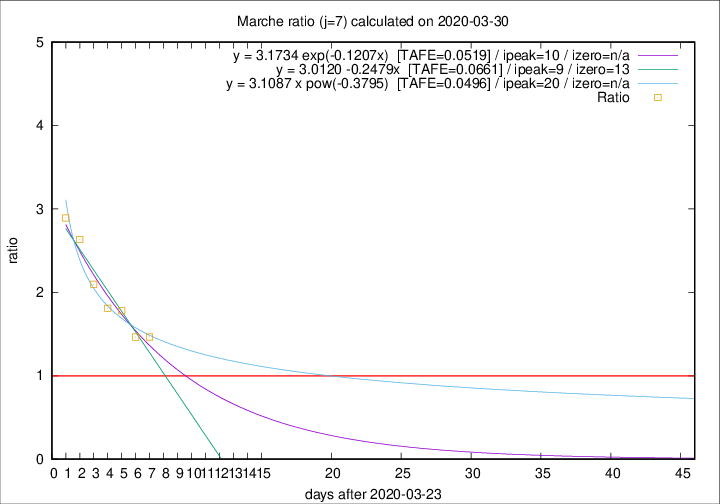

# Marche

Data source: https://raw.githubusercontent.com/pcm-dpc/COVID-19/master/dati-json/dpc-covid19-ita-regioni.json

Delta days analysis (j): 7

Analyses for other values of j for 2020-03-30 are avalable [here](../2020-03-30/README.md)

Analyses for Marche for previous dates are avalable [here](../README.md)

## Fitting 
|fit type|best fit equation|tafe|tfe|ipeak|izero|
|-------|-----|--------|------|---|---|
|linear|y = 3.0120 -0.2479x  [TAFE=0.0661]|0.0661|0.0025|9|13|
|exp|y = 3.1734 exp(-0.1207x)  [TAFE=0.0519]|0.0519|0.0015|10|n/a|
|pow|y = 3.1087 x pow(-0.3795)  [TAFE=0.0496]|0.0496|0.0017|20|n/a|

## Data
|Date|Daily deaths|Cumulated deaths|Deaths in the last 7 days|Deaths in the 7 days before|ratio|
|----|----------|-----------|-------|--------------------|-----|
|2020-03-30|31|417|214|146|1.4658|
|2020-03-29|22|386|202|138|1.4638|
|2020-03-28|28|364|210|118|1.7797|
|2020-03-27|26|336|199|110|1.8091|
|2020-03-26|23|310|195|93|2.0968|
|2020-03-25|56|287|195|74|2.6351|
|2020-03-24|28|231|162|56|2.8929|

[Download data as CSV](COVID-19_marche_j7_2020-03-30.csv)

Generated April 14th, 2020 at 19:16:04 UTC+0200 with https://github.com/robianc/COVID-19
