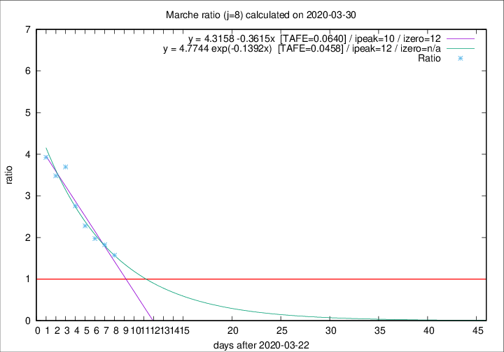

# Marche

Data source: https://raw.githubusercontent.com/pcm-dpc/COVID-19/master/dati-json/dpc-covid19-ita-regioni.json

Delta days analysis (j): 8

Analyses for other values of j for 2020-03-30 are avalable [here](../2020-03-30/README.md)

Analyses for Marche for previous dates are avalable [here](../README.md)

## Fitting 
|fit type|best fit equation|tafe|tfe|ipeak|izero|
|-------|-----|--------|------|---|---|
|linear|y = 4.3158 -0.3615x  [TAFE=0.0640]|0.0640|0.0031|10|12|
|exp|y = 4.7744 exp(-0.1392x)  [TAFE=0.0458]|0.0458|0.0020|12|n/a|

## Data
|Date|Daily deaths|Cumulated deaths|Deaths in the last 8 days|Deaths in the 8 days before|ratio|
|----|----------|-----------|-------|--------------------|-----|
|2020-03-30|31|417|233|148|1.5743|
|2020-03-29|22|386|232|127|1.8268|
|2020-03-28|28|364|227|115|1.9739|
|2020-03-27|26|336|221|97|2.2784|
|2020-03-26|23|310|218|79|2.7595|
|2020-03-25|56|287|218|59|3.6949|
|2020-03-24|28|231|174|50|3.4800|
|2020-03-23|19|203|157|40|3.9250|

[Download data as CSV](COVID-19_marche_j8_2020-03-30.csv)

Generated April 16th, 2020 at 20:09:19 UTC+0200 with https://github.com/robianc/COVID-19
