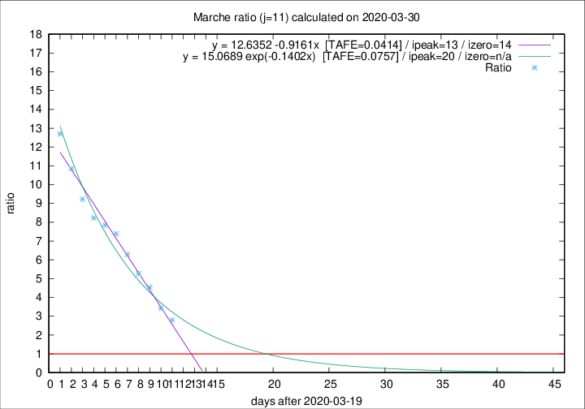

# Marche

Data source: https://raw.githubusercontent.com/pcm-dpc/COVID-19/master/dati-json/dpc-covid19-ita-regioni.json

Estimates in this page were made on 19/4/2020 with data available until 30/03/2020.

## Summary 

### Peak estimate 
|j|linear [TAFE]|exponential [TAFE]|power law [TAFE]|details|
|---|----|-----------|---------|-------|
|7|2/4/2020 [TAFE=0.0661]|3/4/2020 [TAFE=0.0519]|13/4/2020 [TAFE=0.0496]|[analysis](COVID-19_marche_j7_2020-03-30.md)|
|8|2/4/2020 [TAFE=0.0640]|4/4/2020 [TAFE=0.0458]|22/4/2020 [TAFE=0.1015]|[analysis](COVID-19_marche_j8_2020-03-30.md)|
|9|1/4/2020 [TAFE=0.0844]|5/4/2020 [TAFE=0.0630]|30/4/2020 [TAFE=0.1126]|[analysis](COVID-19_marche_j9_2020-03-30.md)|
|10|2/4/2020 [TAFE=0.0449]|7/4/2020 [TAFE=0.0810]|15/6/2020 [TAFE=0.2007]|[analysis](COVID-19_marche_j10_2020-03-30.md)|
|11|2/4/2020 [TAFE=0.0414]|9/4/2020 [TAFE=0.0757]|-|[analysis](COVID-19_marche_j11_2020-03-30.md)|
|12|2/4/2020 [TAFE=0.0894]|11/4/2020 [TAFE=0.0604]|-|[analysis](COVID-19_marche_j12_2020-03-30.md)|
|13|-|-|-||
|14|-|-|-||

Best estimator is linear with j=11 (TAFE=0.0414)
Corresponding peak date estimate is 2/4/2020 (ipeak 13)

Peak date range estimate: 20/3/2020 - 14/6/2020

### End estimate 
|j|linear [TAFE/TFE]|exponential [TAFE/TFE]|power law [TAFE/TFE]|details|
|---|----|-----------|---------|-------|
|7|6/4/2020 [TAFE=0.0661]|-|-|[analysis](COVID-19_marche_j7_2020-03-30.md)|
|8|4/4/2020 [TAFE=0.0640]|-|-|[analysis](COVID-19_marche_j8_2020-03-30.md)|
|9|-|-|-|[analysis](COVID-19_marche_j9_2020-03-30.md)|
|10|4/4/2020 [TAFE=0.0449]|-|-|[analysis](COVID-19_marche_j10_2020-03-30.md)|
|11|3/4/2020 [TAFE=0.0414]|-|-|[analysis](COVID-19_marche_j11_2020-03-30.md)|
|12|-|-|-|[analysis](COVID-19_marche_j12_2020-03-30.md)|
|13|-|-|-||
|14|-|-|-||

Best estimator is linear with j=11 (TAFE=0.0414)
Corresponding end date estimate is 3/4/2020 (izero 14)

End date range estimate: 20/3/2020 - 4/4/2020

Generated April 19th, 2020 at 18:42:39 UTC+0200 with https://github.com/robianc/COVID-19
