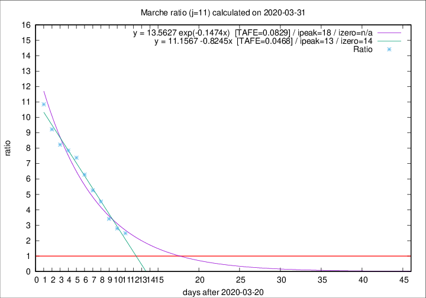

# Marche

Data source: https://raw.githubusercontent.com/pcm-dpc/COVID-19/master/dati-json/dpc-covid19-ita-regioni.json

Delta days analysis (j): 11

Analyses for other values of j for 2020-03-31 are avalable [here](../2020-03-31/README.md)

Analyses for Marche for previous dates are avalable [here](../README.md)

## Fitting 
|fit type|best fit equation|tafe|tfe|ipeak|izero|
|-------|-----|--------|------|---|---|
|linear|y = 11.1567 -0.8245x  [TAFE=0.0468]|0.0468|-0.0014|13|14|
|exp|y = 13.5627 exp(-0.1474x)  [TAFE=0.0829]|0.0829|0.0040|18|n/a|

## Data
|Date|Daily deaths|Cumulated deaths|Deaths in the last 11 days|Deaths in the 11 days before|ratio|
|----|----------|-----------|-------|--------------------|-----|
|2020-03-31|35|452|315|127|2.4803|
|2020-03-30|31|417|302|108|2.7963|
|2020-03-29|22|386|294|86|3.4186|
|2020-03-28|28|364|295|65|4.5385|
|2020-03-27|26|336|279|53|5.2642|
|2020-03-26|23|310|264|42|6.2857|
|2020-03-25|56|287|251|34|7.3824|
|2020-03-24|28|231|204|26|7.8462|
|2020-03-23|19|203|181|22|8.2273|
|2020-03-22|30|184|166|18|9.2222|
|2020-03-21|17|154|141|13|10.8462|

[Download data as CSV](COVID-19_marche_j11_2020-03-31.csv)

Generated April 12th, 2020 at 17:02:01 UTC+0200 with https://github.com/robianc/COVID-19
