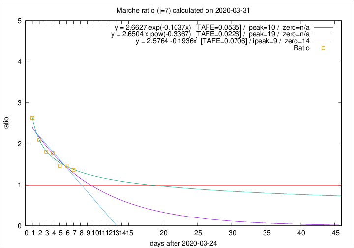

# Marche

Data source: https://raw.githubusercontent.com/pcm-dpc/COVID-19/master/dati-json/dpc-covid19-ita-regioni.json

Delta days analysis (j): 7

Analyses for other values of j for 2020-03-31 are avalable [here](../README.md)

Analyses for Marche for previous dates are avalable [here](../../README.md)

## Fitting 
|fit type|best fit equation|tafe|tfe|ipeak|izero|
|-------|-----|--------|------|---|---|
|linear|y = 2.5764 -0.1936x  [TAFE=0.0706]|0.0706|0.0033|9|14|
|exp|y = 2.6627 exp(-0.1037x)  [TAFE=0.0535]|0.0535|0.0017|10|n/a|
|pow|y = 2.6504 x pow(-0.3367)  [TAFE=0.0226]|0.0226|0.0006|19|n/a|

## Data
|Date|Daily deaths|Cumulated deaths|Deaths in the last 7 days|Deaths in the 7 days before|ratio|
|----|----------|-----------|-------|--------------------|-----|
|2020-03-31|35|452|221|162|1.3642|
|2020-03-30|31|417|214|146|1.4658|
|2020-03-29|22|386|202|138|1.4638|
|2020-03-28|28|364|210|118|1.7797|
|2020-03-27|26|336|199|110|1.8091|
|2020-03-26|23|310|195|93|2.0968|
|2020-03-25|56|287|195|74|2.6351|

[Download data as CSV](COVID-19_marche_j7_2020-03-31.csv)

Generated April 10th, 2020 at 17:26:10 UTC+0200 with https://github.com/robianc/COVID-19
