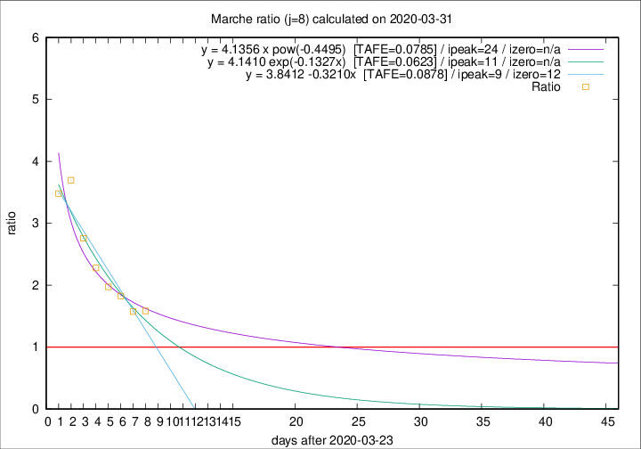

# Marche

Data source: https://raw.githubusercontent.com/pcm-dpc/COVID-19/master/dati-json/dpc-covid19-ita-regioni.json

Delta days analysis (j): 8

Analyses for other values of j for 2020-03-31 are avalable [here](../2020-03-31/README.md)

Analyses for Marche for previous dates are avalable [here](../README.md)

## Fitting 
|fit type|best fit equation|tafe|tfe|ipeak|izero|
|-------|-----|--------|------|---|---|
|linear|y = 3.8412 -0.3210x  [TAFE=0.0878]|0.0878|0.0049|9|12|
|exp|y = 4.1410 exp(-0.1327x)  [TAFE=0.0623]|0.0623|0.0029|11|n/a|
|pow|y = 4.1356 x pow(-0.4495)  [TAFE=0.0785]|0.0785|0.0054|24|n/a|

## Data
|Date|Daily deaths|Cumulated deaths|Deaths in the last 8 days|Deaths in the 8 days before|ratio|
|----|----------|-----------|-------|--------------------|-----|
|2020-03-31|35|452|249|157|1.5860|
|2020-03-30|31|417|233|148|1.5743|
|2020-03-29|22|386|232|127|1.8268|
|2020-03-28|28|364|227|115|1.9739|
|2020-03-27|26|336|221|97|2.2784|
|2020-03-26|23|310|218|79|2.7595|
|2020-03-25|56|287|218|59|3.6949|
|2020-03-24|28|231|174|50|3.4800|

[Download data as CSV](COVID-19_marche_j8_2020-03-31.csv)

Generated April 19th, 2020 at 18:42:39 UTC+0200 with https://github.com/robianc/COVID-19
