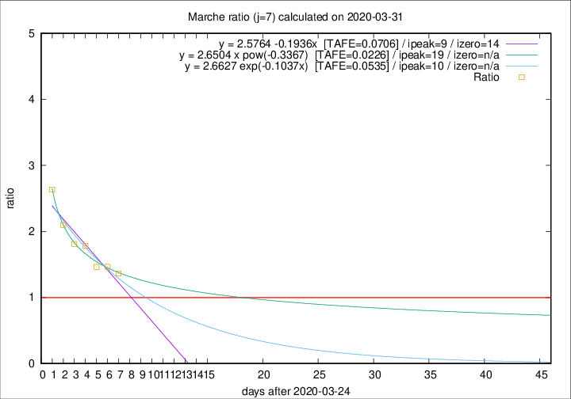

# Marche

Data source: https://raw.githubusercontent.com/pcm-dpc/COVID-19/master/dati-json/dpc-covid19-ita-regioni.json

Estimates in this page were made on 16/4/2020 with data available until 31/03/2020.

## Summary 

### Peak estimate 
|j|linear [TAFE]|exponential [TAFE]|power law [TAFE]|details|
|---|----|-----------|---------|-------|
|7|3/4/2020 [TAFE=0.0706]|4/4/2020 [TAFE=0.0535]|13/4/2020 [TAFE=0.0226]|[analysis](COVID-19_marche_j7_2020-03-31.md)|
|8|2/4/2020 [TAFE=0.0878]|4/4/2020 [TAFE=0.0623]|17/4/2020 [TAFE=0.0785]|[analysis](COVID-19_marche_j8_2020-03-31.md)|
|9|2/4/2020 [TAFE=0.0867]|5/4/2020 [TAFE=0.0570]|26/4/2020 [TAFE=0.1207]|[analysis](COVID-19_marche_j9_2020-03-31.md)|
|10|2/4/2020 [TAFE=0.0655]|6/4/2020 [TAFE=0.0589]|12/5/2020 [TAFE=0.1631]|[analysis](COVID-19_marche_j10_2020-03-31.md)|
|11|3/4/2020 [TAFE=0.0468]|8/4/2020 [TAFE=0.0829]|18/6/2020 [TAFE=0.1976]|[analysis](COVID-19_marche_j11_2020-03-31.md)|
|12|2/4/2020 [TAFE=0.0939]|10/4/2020 [TAFE=0.0679]|-|[analysis](COVID-19_marche_j12_2020-03-31.md)|
|13|-|-|-||
|14|-|-|-||

Best estimator is pow with j=7 (TAFE=0.0226)
Corresponding peak date estimate is 13/4/2020 (ipeak 19)

Peak date range estimate: 25/3/2020 - 22/6/2020

### End estimate 
|j|linear [TAFE/TFE]|exponential [TAFE/TFE]|power law [TAFE/TFE]|details|
|---|----|-----------|---------|-------|
|7|8/4/2020 [TAFE=0.0706]|-|-|[analysis](COVID-19_marche_j7_2020-03-31.md)|
|8|-|-|-|[analysis](COVID-19_marche_j8_2020-03-31.md)|
|9|-|-|-|[analysis](COVID-19_marche_j9_2020-03-31.md)|
|10|4/4/2020 [TAFE=0.0655]|-|-|[analysis](COVID-19_marche_j10_2020-03-31.md)|
|11|4/4/2020 [TAFE=0.0468]|-|-|[analysis](COVID-19_marche_j11_2020-03-31.md)|
|12|-|-|-|[analysis](COVID-19_marche_j12_2020-03-31.md)|
|13|-|-|-||
|14|-|-|-||

Best estimator is linear with j=11 (TAFE=0.0468)
Corresponding end date estimate is 4/4/2020 (izero 14)

End date range estimate: 21/3/2020 - 4/4/2020

Generated April 16th, 2020 at 20:09:19 UTC+0200 with https://github.com/robianc/COVID-19
