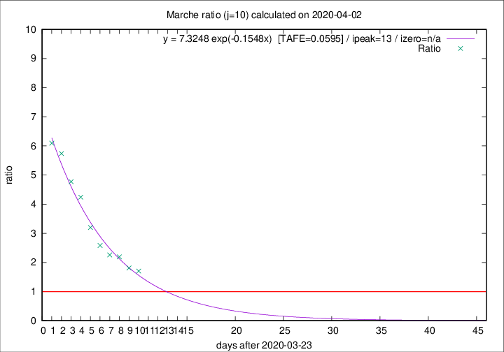

# Marche

Data source: https://raw.githubusercontent.com/pcm-dpc/COVID-19/master/dati-json/dpc-covid19-ita-regioni.json

Delta days analysis (j): 10

Analyses for other values of j for 2020-04-02 are avalable [here](../README.md)

Analyses for Marche for previous dates are avalable [here](../../README.md)

## Fitting 
|fit type|best fit equation|tafe|tfe|ipeak|izero|
|-------|-----|--------|------|---|---|
|exp|y = 7.3248 exp(-0.1548x)  [TAFE=0.0595]|0.0595|0.0024|13|n/a|

## Data
|Date|Daily deaths|Cumulated deaths|Deaths in the last 10 days|Deaths in the 10 days before|ratio|
|----|----------|-----------|-------|--------------------|-----|
|2020-04-02|26|503|300|176|1.7045|
|2020-04-01|25|477|293|162|1.8086|
|2020-03-31|35|452|298|136|2.1912|
|2020-03-30|31|417|280|124|2.2581|
|2020-03-29|22|386|271|105|2.5810|
|2020-03-28|28|364|272|85|3.2000|
|2020-03-27|26|336|267|63|4.2381|
|2020-03-26|23|310|253|53|4.7736|
|2020-03-25|56|287|241|42|5.7381|
|2020-03-24|28|231|195|32|6.0938|

[Download data as CSV](COVID-19_marche_j10_2020-04-02.csv)

Generated April 10th, 2020 at 17:26:10 UTC+0200 with https://github.com/robianc/COVID-19
