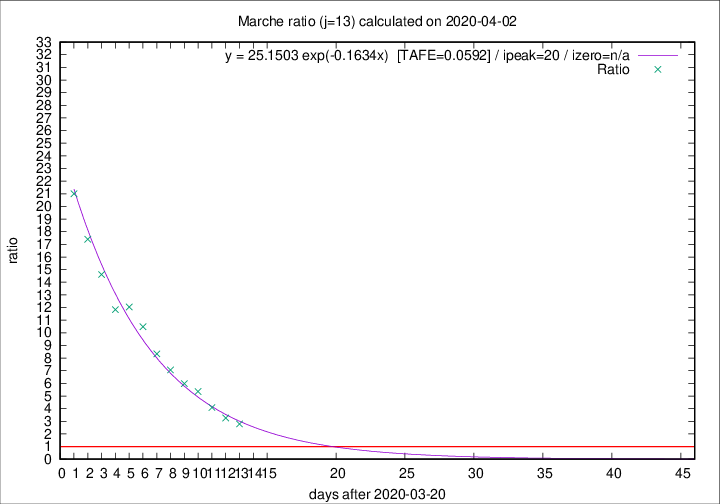

# Marche

Data source: https://raw.githubusercontent.com/pcm-dpc/COVID-19/master/dati-json/dpc-covid19-ita-regioni.json

Delta days analysis (j): 13

Analyses for other values of j for 2020-04-02 are avalable [here](../README.md)

Analyses for Marche for previous dates are avalable [here](../../README.md)

## Fitting 
|fit type|best fit equation|tafe|tfe|ipeak|izero|
|-------|-----|--------|------|---|---|
|exp|y = 25.1503 exp(-0.1634x)  [TAFE=0.0592]|0.0592|0.0023|20|n/a|

## Data
|Date|Daily deaths|Cumulated deaths|Deaths in the last 13 days|Deaths in the 13 days before|ratio|
|----|----------|-----------|-------|--------------------|-----|
|2020-04-02|26|503|366|131|2.7939|
|2020-04-01|25|477|362|111|3.2613|
|2020-03-31|35|452|360|88|4.0909|
|2020-03-30|31|417|348|65|5.3538|
|2020-03-29|22|386|329|55|5.9818|
|2020-03-28|28|364|318|45|7.0667|
|2020-03-27|26|336|300|36|8.3333|
|2020-03-26|23|310|283|27|10.4815|
|2020-03-25|56|287|265|22|12.0455|
|2020-03-24|28|231|213|18|11.8333|
|2020-03-23|19|203|190|13|14.6154|
|2020-03-22|30|184|174|10|17.4000|
|2020-03-21|17|154|147|7|21.0000|

[Download data as CSV](COVID-19_marche_j13_2020-04-02.csv)

Generated April 12th, 2020 at 16:28:18 UTC+0200 with https://github.com/robianc/COVID-19
