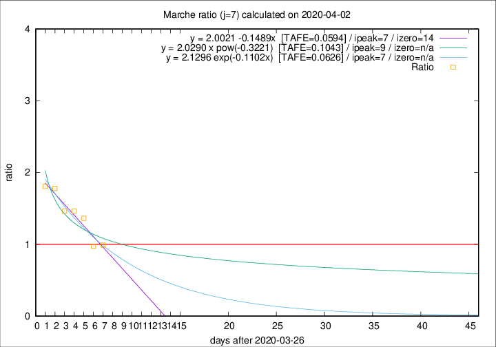

# Marche

Data source: https://raw.githubusercontent.com/pcm-dpc/COVID-19/master/dati-json/dpc-covid19-ita-regioni.json

Delta days analysis (j): 7

## Fitting 
|fit type|best fit equation|tafe|tfe|ipeak|izero|
|-------|-----|--------|------|---|---|
|linear|y = 2.0021 -0.1489x  [TAFE=0.0594]|0.0594|0.0048|7|14|
|exp|y = 2.1296 exp(-0.1102x)  [TAFE=0.0626]|0.0626|0.0025|7|n/a|
|pow|y = 2.0290 x pow(-0.3221)  [TAFE=0.1043]|0.1043|0.0061|9|n/a|

## Data
|Date|Daily deaths|Cumulated deaths|Deaths in the last 7 days|Deaths in the 7 days before|ratio|
|----|----------|-----------|-------|--------------------|-----|
|2020-04-02|26|503|193|195|0.9897|
|2020-04-01|25|477|190|195|0.9744|
|2020-03-31|35|452|221|162|1.3642|
|2020-03-30|31|417|214|146|1.4658|
|2020-03-29|22|386|202|138|1.4638|
|2020-03-28|28|364|210|118|1.7797|
|2020-03-27|26|336|199|110|1.8091|

[Download data as CSV](COVID-19_marche_j7_2020-04-02.csv)

Generated April 9th, 2020 at 16:40:48 UTC+0200 with https://github.com/robianc/COVID-19
