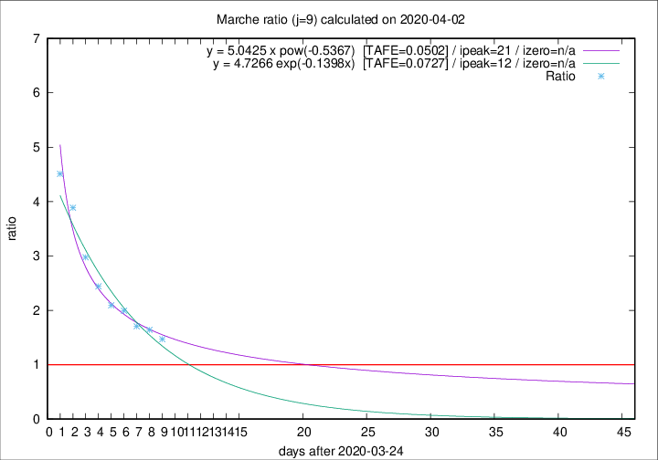

# Marche

Data source: https://raw.githubusercontent.com/pcm-dpc/COVID-19/master/dati-json/dpc-covid19-ita-regioni.json

Estimates in this page were made on 19/4/2020 with data available until 02/04/2020.

## Summary 

### Peak estimate 
|j|linear [TAFE]|exponential [TAFE]|power law [TAFE]|details|
|---|----|-----------|---------|-------|
|7|3/4/2020 [TAFE=0.0594]|3/4/2020 [TAFE=0.0626]|5/4/2020 [TAFE=0.1043]|[analysis](COVID-19_marche_j7_2020-04-02.md)|
|8|4/4/2020 [TAFE=0.0661]|4/4/2020 [TAFE=0.0610]|10/4/2020 [TAFE=0.0840]|[analysis](COVID-19_marche_j8_2020-04-02.md)|
|9|4/4/2020 [TAFE=0.1342]|6/4/2020 [TAFE=0.0727]|15/4/2020 [TAFE=0.0502]|[analysis](COVID-19_marche_j9_2020-04-02.md)|
|10|4/4/2020 [TAFE=0.1186]|6/4/2020 [TAFE=0.0595]|23/4/2020 [TAFE=0.1185]|[analysis](COVID-19_marche_j10_2020-04-02.md)|
|11|4/4/2020 [TAFE=0.1067]|8/4/2020 [TAFE=0.0619]|7/5/2020 [TAFE=0.1851]|[analysis](COVID-19_marche_j11_2020-04-02.md)|
|12|4/4/2020 [TAFE=0.1036]|9/4/2020 [TAFE=0.0689]|28/5/2020 [TAFE=0.2116]|[analysis](COVID-19_marche_j12_2020-04-02.md)|
|13|4/4/2020 [TAFE=0.1376]|10/4/2020 [TAFE=0.0592]|13/6/2020 [TAFE=0.2086]|[analysis](COVID-19_marche_j13_2020-04-02.md)|
|14|-|-|-||

Best estimator is pow with j=9 (TAFE=0.0502)
Corresponding peak date estimate is 15/4/2020 (ipeak 21)

Peak date range estimate: 25/3/2020 - 17/6/2020

### End estimate 
|j|linear [TAFE/TFE]|exponential [TAFE/TFE]|power law [TAFE/TFE]|details|
|---|----|-----------|---------|-------|
|7|10/4/2020 [TAFE=0.0594]|-|-|[analysis](COVID-19_marche_j7_2020-04-02.md)|
|8|-|-|-|[analysis](COVID-19_marche_j8_2020-04-02.md)|
|9|-|-|-|[analysis](COVID-19_marche_j9_2020-04-02.md)|
|10|-|-|-|[analysis](COVID-19_marche_j10_2020-04-02.md)|
|11|-|-|-|[analysis](COVID-19_marche_j11_2020-04-02.md)|
|12|-|-|-|[analysis](COVID-19_marche_j12_2020-04-02.md)|
|13|-|-|-|[analysis](COVID-19_marche_j13_2020-04-02.md)|
|14|-|-|-||

Best estimator is linear with j=7 (TAFE=0.0594)
Corresponding end date estimate is 10/4/2020 (izero 14)

End date range estimate: 27/3/2020 - 10/4/2020

Generated April 19th, 2020 at 18:42:39 UTC+0200 with https://github.com/robianc/COVID-19
