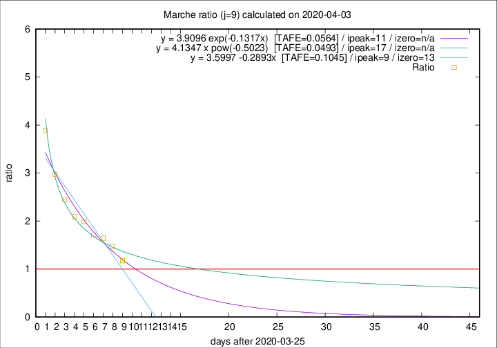

# Marche

Data source: https://raw.githubusercontent.com/pcm-dpc/COVID-19/master/dati-json/dpc-covid19-ita-regioni.json

Estimates in this page were made on 10/4/2020 with data available until 03/04/2020.

## Summary 

### Peak estimate 
|j|linear [TAFE]|exponential [TAFE]|power law [TAFE]|details|
|---|----|-----------|---------|-------|
|7|4/4/2020 [TAFE=0.0897]|4/4/2020 [TAFE=0.0864]|5/4/2020 [TAFE=0.0838]|[analysis](COVID-19_marche_j7_2020-04-03.md)|
|8|5/4/2020 [TAFE=0.0671]|5/4/2020 [TAFE=0.0600]|9/4/2020 [TAFE=0.0893]|[analysis](COVID-19_marche_j8_2020-04-03.md)|
|9|4/4/2020 [TAFE=0.1045]|6/4/2020 [TAFE=0.0564]|12/4/2020 [TAFE=0.0493]|[analysis](COVID-19_marche_j9_2020-04-03.md)|
|10|5/4/2020 [TAFE=0.1500]|7/4/2020 [TAFE=0.0778]|19/4/2020 [TAFE=0.0731]|[analysis](COVID-19_marche_j10_2020-04-03.md)|
|11|4/4/2020 [TAFE=0.1455]|8/4/2020 [TAFE=0.0640]|28/4/2020 [TAFE=0.1424]|[analysis](COVID-19_marche_j11_2020-04-03.md)|
|12|5/4/2020 [TAFE=0.1191]|9/4/2020 [TAFE=0.0701]|16/5/2020 [TAFE=0.2059]|[analysis](COVID-19_marche_j12_2020-04-03.md)|
|13|4/4/2020 [TAFE=0.1390]|10/4/2020 [TAFE=0.0623]|1/6/2020 [TAFE=0.2143]|[analysis](COVID-19_marche_j13_2020-04-03.md)|
|14|-|-|-||

Best estimator is pow with j=9 (TAFE=0.0493)
Corresponding peak date estimate is 12/4/2020 (ipeak 17)

Peak date range estimate: 26/3/2020 - 5/6/2020

### End estimate 
|j|linear [TAFE/TFE]|exponential [TAFE/TFE]|power law [TAFE/TFE]|details|
|---|----|-----------|---------|-------|
|7|12/4/2020 [TAFE=0.0897]|-|-|[analysis](COVID-19_marche_j7_2020-04-03.md)|
|8|10/4/2020 [TAFE=0.0671]|-|-|[analysis](COVID-19_marche_j8_2020-04-03.md)|
|9|-|-|-|[analysis](COVID-19_marche_j9_2020-04-03.md)|
|10|-|-|-|[analysis](COVID-19_marche_j10_2020-04-03.md)|
|11|-|-|-|[analysis](COVID-19_marche_j11_2020-04-03.md)|
|12|-|-|-|[analysis](COVID-19_marche_j12_2020-04-03.md)|
|13|-|-|-|[analysis](COVID-19_marche_j13_2020-04-03.md)|
|14|-|-|-||

Best estimator is linear with j=8 (TAFE=0.0671)
Corresponding end date estimate is 10/4/2020 (izero 14)

End date range estimate: 27/3/2020 - 11/4/2020

Generated April 10th, 2020 at 17:26:10 UTC+0200 with https://github.com/robianc/COVID-19
