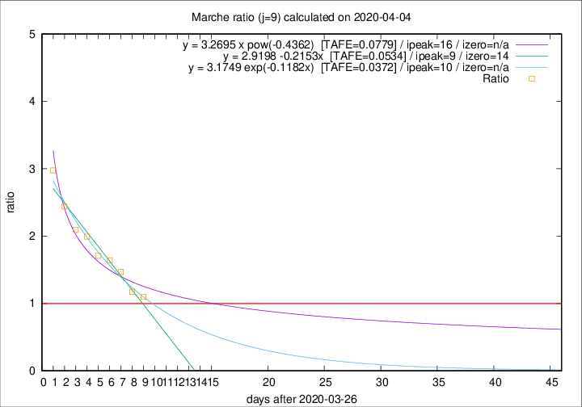

# Marche

Data source: https://raw.githubusercontent.com/pcm-dpc/COVID-19/master/dati-json/dpc-covid19-ita-regioni.json

Estimates in this page were made on 12/4/2020 with data available until 04/04/2020.

## Summary 

### Peak estimate 
|j|linear [TAFE]|exponential [TAFE]|power law [TAFE]|details|
|---|----|-----------|---------|-------|
|7|5/4/2020 [TAFE=0.0889]|5/4/2020 [TAFE=0.0850]|5/4/2020 [TAFE=0.0853]|[analysis](COVID-19_marche_j7_2020-04-04.md)|
|8|5/4/2020 [TAFE=0.0683]|6/4/2020 [TAFE=0.0619]|8/4/2020 [TAFE=0.0835]|[analysis](COVID-19_marche_j8_2020-04-04.md)|
|9|5/4/2020 [TAFE=0.0534]|6/4/2020 [TAFE=0.0372]|12/4/2020 [TAFE=0.0779]|[analysis](COVID-19_marche_j9_2020-04-04.md)|
|10|5/4/2020 [TAFE=0.1406]|7/4/2020 [TAFE=0.0720]|15/4/2020 [TAFE=0.0809]|[analysis](COVID-19_marche_j10_2020-04-04.md)|
|11|5/4/2020 [TAFE=0.1745]|8/4/2020 [TAFE=0.0786]|23/4/2020 [TAFE=0.0940]|[analysis](COVID-19_marche_j11_2020-04-04.md)|
|12|5/4/2020 [TAFE=0.1634]|9/4/2020 [TAFE=0.0646]|4/5/2020 [TAFE=0.1747]|[analysis](COVID-19_marche_j12_2020-04-04.md)|
|13|5/4/2020 [TAFE=0.1650]|10/4/2020 [TAFE=0.0601]|19/5/2020 [TAFE=0.2201]|[analysis](COVID-19_marche_j13_2020-04-04.md)|
|14|-|-|-||

Best estimator is exp with j=9 (TAFE=0.0372)
Corresponding peak date estimate is 6/4/2020 (ipeak 10)

Peak date range estimate: 27/3/2020 - 23/5/2020

### End estimate 
|j|linear [TAFE/TFE]|exponential [TAFE/TFE]|power law [TAFE/TFE]|details|
|---|----|-----------|---------|-------|
|7|16/4/2020 [TAFE=0.0889]|-|-|[analysis](COVID-19_marche_j7_2020-04-04.md)|
|8|12/4/2020 [TAFE=0.0683]|-|-|[analysis](COVID-19_marche_j8_2020-04-04.md)|
|9|10/4/2020 [TAFE=0.0534]|-|-|[analysis](COVID-19_marche_j9_2020-04-04.md)|
|10|-|-|-|[analysis](COVID-19_marche_j10_2020-04-04.md)|
|11|-|-|-|[analysis](COVID-19_marche_j11_2020-04-04.md)|
|12|-|-|-|[analysis](COVID-19_marche_j12_2020-04-04.md)|
|13|-|-|-|[analysis](COVID-19_marche_j13_2020-04-04.md)|
|14|-|-|-||

Best estimator is linear with j=9 (TAFE=0.0534)
Corresponding end date estimate is 10/4/2020 (izero 14)

End date range estimate: 27/3/2020 - 14/4/2020

Generated April 12th, 2020 at 16:28:18 UTC+0200 with https://github.com/robianc/COVID-19
