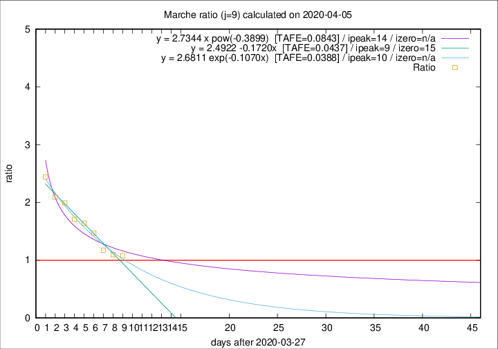

# Marche

Data source: https://raw.githubusercontent.com/pcm-dpc/COVID-19/master/dati-json/dpc-covid19-ita-regioni.json

Delta days analysis (j): 9

Analyses for other values of j for 2020-04-05 are avalable [here](../README.md)

Analyses for Marche for previous dates are avalable [here](../../README.md)

## Fitting 
|fit type|best fit equation|tafe|tfe|ipeak|izero|
|-------|-----|--------|------|---|---|
|linear|y = 2.4922 -0.1720x  [TAFE=0.0437]|0.0437|0.0007|9|15|
|exp|y = 2.6811 exp(-0.1070x)  [TAFE=0.0388]|0.0388|0.0008|10|n/a|
|pow|y = 2.7344 x pow(-0.3899)  [TAFE=0.0843]|0.0843|0.0041|14|n/a|

## Data
|Date|Daily deaths|Cumulated deaths|Deaths in the last 9 days|Deaths in the 9 days before|ratio|
|----|----------|-----------|-------|--------------------|-----|
|2020-04-05|25|599|263|244|1.0779|
|2020-04-04|17|574|264|241|1.0954|
|2020-04-03|54|557|270|230|1.1739|
|2020-04-02|26|503|272|185|1.4703|
|2020-04-01|25|477|274|167|1.6407|
|2020-03-31|35|452|268|157|1.7070|
|2020-03-30|31|417|263|132|1.9924|
|2020-03-29|22|386|249|119|2.0924|
|2020-03-28|28|364|249|102|2.4412|

[Download data as CSV](COVID-19_marche_j9_2020-04-05.csv)

Generated April 10th, 2020 at 17:26:10 UTC+0200 with https://github.com/robianc/COVID-19
