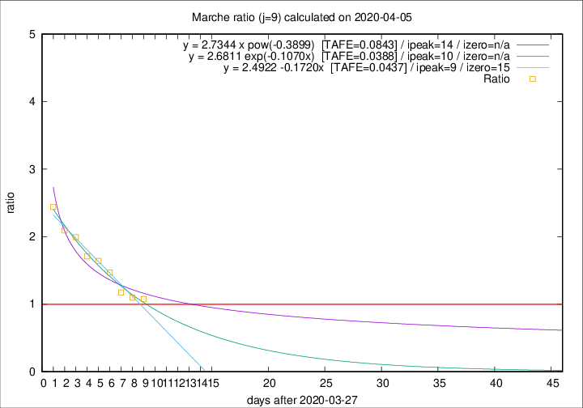

# Marche

Data source: https://raw.githubusercontent.com/pcm-dpc/COVID-19/master/dati-json/dpc-covid19-ita-regioni.json

Estimates in this page were made on 12/4/2020 with data available until 05/04/2020.

## Summary 

### Peak estimate 
|j|linear [TAFE]|exponential [TAFE]|power law [TAFE]|details|
|---|----|-----------|---------|-------|
|7|6/4/2020 [TAFE=0.0990]|6/4/2020 [TAFE=0.0970]|6/4/2020 [TAFE=0.0768]|[analysis](COVID-19_marche_j7_2020-04-05.md)|
|8|6/4/2020 [TAFE=0.0746]|6/4/2020 [TAFE=0.0668]|7/4/2020 [TAFE=0.0614]|[analysis](COVID-19_marche_j8_2020-04-05.md)|
|9|6/4/2020 [TAFE=0.0437]|7/4/2020 [TAFE=0.0388]|11/4/2020 [TAFE=0.0843]|[analysis](COVID-19_marche_j9_2020-04-05.md)|
|10|6/4/2020 [TAFE=0.1095]|7/4/2020 [TAFE=0.0641]|13/4/2020 [TAFE=0.0804]|[analysis](COVID-19_marche_j10_2020-04-05.md)|
|11|6/4/2020 [TAFE=0.1770]|8/4/2020 [TAFE=0.0763]|18/4/2020 [TAFE=0.0983]|[analysis](COVID-19_marche_j11_2020-04-05.md)|
|12|6/4/2020 [TAFE=0.2014]|9/4/2020 [TAFE=0.0637]|27/4/2020 [TAFE=0.1184]|[analysis](COVID-19_marche_j12_2020-04-05.md)|
|13|6/4/2020 [TAFE=0.1978]|11/4/2020 [TAFE=0.0592]|10/5/2020 [TAFE=0.2051]|[analysis](COVID-19_marche_j13_2020-04-05.md)|
|14|6/4/2020 [TAFE=0.2152]|11/4/2020 [TAFE=0.0408]|22/5/2020 [TAFE=0.2337]|[analysis](COVID-19_marche_j14_2020-04-05.md)|

Best estimator is exp with j=9 (TAFE=0.0388)
Corresponding peak date estimate is 7/4/2020 (ipeak 10)

Peak date range estimate: 4/4/2020 - 27/5/2020

### End estimate 
|j|linear [TAFE/TFE]|exponential [TAFE/TFE]|power law [TAFE/TFE]|details|
|---|----|-----------|---------|-------|
|7|21/4/2020 [TAFE=0.0990]|-|-|[analysis](COVID-19_marche_j7_2020-04-05.md)|
|8|14/4/2020 [TAFE=0.0746]|-|-|[analysis](COVID-19_marche_j8_2020-04-05.md)|
|9|12/4/2020 [TAFE=0.0437]|-|-|[analysis](COVID-19_marche_j9_2020-04-05.md)|
|10|-|-|-|[analysis](COVID-19_marche_j10_2020-04-05.md)|
|11|-|-|-|[analysis](COVID-19_marche_j11_2020-04-05.md)|
|12|-|-|-|[analysis](COVID-19_marche_j12_2020-04-05.md)|
|13|-|-|-|[analysis](COVID-19_marche_j13_2020-04-05.md)|
|14|-|-|-|[analysis](COVID-19_marche_j14_2020-04-05.md)|

Best estimator is linear with j=9 (TAFE=0.0437)
Corresponding end date estimate is 12/4/2020 (izero 15)

End date range estimate: 28/3/2020 - 19/4/2020

Generated April 12th, 2020 at 17:02:01 UTC+0200 with https://github.com/robianc/COVID-19
