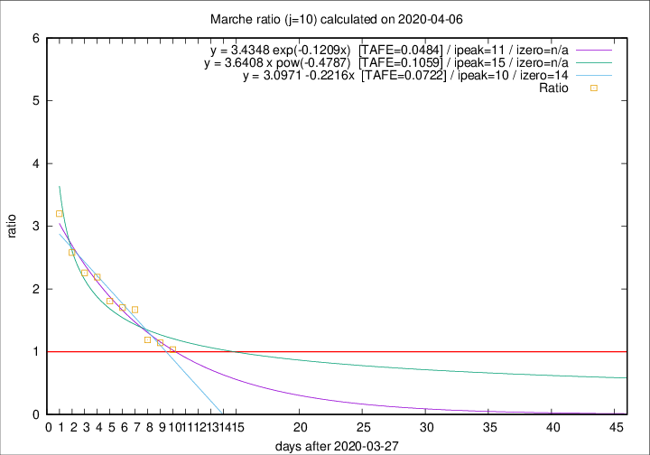

# Marche

Data source: https://raw.githubusercontent.com/pcm-dpc/COVID-19/master/dati-json/dpc-covid19-ita-regioni.json

Delta days analysis (j): 10

Analyses for other values of j for 2020-04-06 are avalable [here](../2020-04-06/README.md)

Analyses for Marche for previous dates are avalable [here](../README.md)

## Fitting 
|fit type|best fit equation|tafe|tfe|ipeak|izero|
|-------|-----|--------|------|---|---|
|linear|y = 3.0971 -0.2216x  [TAFE=0.0722]|0.0722|0.0004|10|14|
|exp|y = 3.4348 exp(-0.1209x)  [TAFE=0.0484]|0.0484|0.0017|11|n/a|
|pow|y = 3.6408 x pow(-0.4787)  [TAFE=0.1059]|0.1059|0.0067|15|n/a|

## Data
|Date|Daily deaths|Cumulated deaths|Deaths in the last 10 days|Deaths in the 10 days before|ratio|
|----|----------|-----------|-------|--------------------|-----|
|2020-04-06|13|612|276|267|1.0337|
|2020-04-05|25|599|289|253|1.1423|
|2020-04-04|17|574|287|241|1.1909|
|2020-04-03|54|557|326|195|1.6718|
|2020-04-02|26|503|300|176|1.7045|
|2020-04-01|25|477|293|162|1.8086|
|2020-03-31|35|452|298|136|2.1912|
|2020-03-30|31|417|280|124|2.2581|
|2020-03-29|22|386|271|105|2.5810|
|2020-03-28|28|364|272|85|3.2000|

[Download data as CSV](COVID-19_marche_j10_2020-04-06.csv)

Generated April 14th, 2020 at 19:16:04 UTC+0200 with https://github.com/robianc/COVID-19
