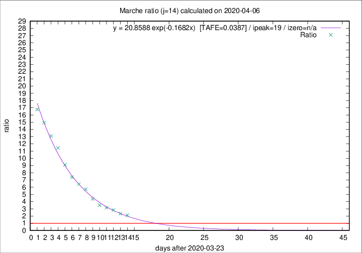

# Marche

Data source: https://raw.githubusercontent.com/pcm-dpc/COVID-19/master/dati-json/dpc-covid19-ita-regioni.json

Delta days analysis (j): 14

Analyses for other values of j for 2020-04-06 are avalable [here](../2020-04-06/README.md)

Analyses for Marche for previous dates are avalable [here](../README.md)

## Fitting 
|fit type|best fit equation|tafe|tfe|ipeak|izero|
|-------|-----|--------|------|---|---|
|exp|y = 20.8588 exp(-0.1682x)  [TAFE=0.0387]|0.0387|0.0010|19|n/a|

## Data
|Date|Daily deaths|Cumulated deaths|Deaths in the last 14 days|Deaths in the 14 days before|ratio|
|----|----------|-----------|-------|--------------------|-----|
|2020-04-06|13|612|409|193|2.1192|
|2020-04-05|25|599|415|177|2.3446|
|2020-04-04|17|574|420|148|2.8378|
|2020-04-03|54|557|420|133|3.1579|
|2020-04-02|26|503|388|111|3.4955|
|2020-04-01|25|477|385|88|4.3750|
|2020-03-31|35|452|383|67|5.7164|
|2020-03-30|31|417|360|56|6.4286|
|2020-03-29|22|386|340|46|7.3913|
|2020-03-28|28|364|328|36|9.1111|
|2020-03-27|26|336|309|27|11.4444|
|2020-03-26|23|310|288|22|13.0909|
|2020-03-25|56|287|269|18|14.9444|
|2020-03-24|28|231|218|13|16.7692|

[Download data as CSV](COVID-19_marche_j14_2020-04-06.csv)

Generated April 12th, 2020 at 17:02:01 UTC+0200 with https://github.com/robianc/COVID-19
