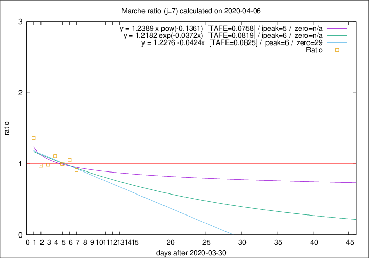

# Marche

Data source: https://raw.githubusercontent.com/pcm-dpc/COVID-19/master/dati-json/dpc-covid19-ita-regioni.json

Delta days analysis (j): 7

Analyses for other values of j for 2020-04-06 are avalable [here](../2020-04-06/README.md)

Analyses for Marche for previous dates are avalable [here](../README.md)

## Fitting 
|fit type|best fit equation|tafe|tfe|ipeak|izero|
|-------|-----|--------|------|---|---|
|linear|y = 1.2276 -0.0424x  [TAFE=0.0825]|0.0825|0.0095|6|29|
|exp|y = 1.2182 exp(-0.0372x)  [TAFE=0.0819]|0.0819|0.0047|6|n/a|
|pow|y = 1.2389 x pow(-0.1361)  [TAFE=0.0758]|0.0758|0.0037|5|n/a|

## Data
|Date|Daily deaths|Cumulated deaths|Deaths in the last 7 days|Deaths in the 7 days before|ratio|
|----|----------|-----------|-------|--------------------|-----|
|2020-04-06|13|612|195|214|0.9112|
|2020-04-05|25|599|213|202|1.0545|
|2020-04-04|17|574|210|210|1.0000|
|2020-04-03|54|557|221|199|1.1106|
|2020-04-02|26|503|193|195|0.9897|
|2020-04-01|25|477|190|195|0.9744|
|2020-03-31|35|452|221|162|1.3642|

[Download data as CSV](COVID-19_marche_j7_2020-04-06.csv)

Generated April 16th, 2020 at 20:09:19 UTC+0200 with https://github.com/robianc/COVID-19
