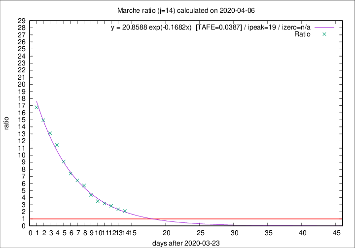
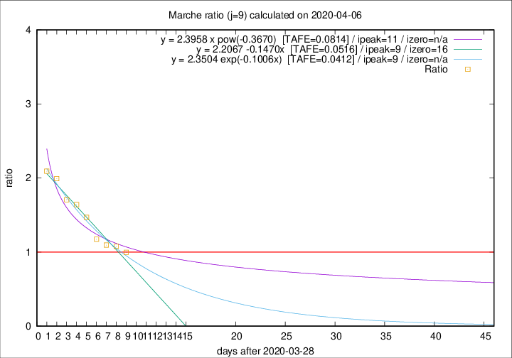

# Marche

Data source: https://raw.githubusercontent.com/pcm-dpc/COVID-19/master/dati-json/dpc-covid19-ita-regioni.json

Estimates in this page were made on 19/4/2020 with data available until 06/04/2020.

## Summary 

### Peak estimate 
|j|linear [TAFE]|exponential [TAFE]|power law [TAFE]|details|
|---|----|-----------|---------|-------|
|7|6/4/2020 [TAFE=0.0825]|6/4/2020 [TAFE=0.0819]|5/4/2020 [TAFE=0.0758]|[analysis](COVID-19_marche_j7_2020-04-06.md)|
|8|6/4/2020 [TAFE=0.0728]|6/4/2020 [TAFE=0.0649]|7/4/2020 [TAFE=0.0664]|[analysis](COVID-19_marche_j8_2020-04-06.md)|
|9|7/4/2020 [TAFE=0.0516]|7/4/2020 [TAFE=0.0412]|9/4/2020 [TAFE=0.0814]|[analysis](COVID-19_marche_j9_2020-04-06.md)|
|10|7/4/2020 [TAFE=0.0722]|8/4/2020 [TAFE=0.0484]|12/4/2020 [TAFE=0.1059]|[analysis](COVID-19_marche_j10_2020-04-06.md)|
|11|7/4/2020 [TAFE=0.1518]|8/4/2020 [TAFE=0.0701]|15/4/2020 [TAFE=0.1100]|[analysis](COVID-19_marche_j11_2020-04-06.md)|
|12|7/4/2020 [TAFE=0.1907]|9/4/2020 [TAFE=0.0659]|22/4/2020 [TAFE=0.1208]|[analysis](COVID-19_marche_j12_2020-04-06.md)|
|13|7/4/2020 [TAFE=0.2310]|11/4/2020 [TAFE=0.0524]|30/4/2020 [TAFE=0.1523]|[analysis](COVID-19_marche_j13_2020-04-06.md)|
|14|7/4/2020 [TAFE=0.2455]|12/4/2020 [TAFE=0.0387]|12/5/2020 [TAFE=0.2143]|[analysis](COVID-19_marche_j14_2020-04-06.md)|

Best estimator is exp with j=14 (TAFE=0.0387)
Corresponding peak date estimate is 12/4/2020 (ipeak 19)

Peak date range estimate: 29/3/2020 - 12/5/2020

### End estimate 
|j|linear [TAFE/TFE]|exponential [TAFE/TFE]|power law [TAFE/TFE]|details|
|---|----|-----------|---------|-------|
|7|29/4/2020 [TAFE=0.0825]|-|-|[analysis](COVID-19_marche_j7_2020-04-06.md)|
|8|17/4/2020 [TAFE=0.0728]|-|-|[analysis](COVID-19_marche_j8_2020-04-06.md)|
|9|14/4/2020 [TAFE=0.0516]|-|-|[analysis](COVID-19_marche_j9_2020-04-06.md)|
|10|-|-|-|[analysis](COVID-19_marche_j10_2020-04-06.md)|
|11|-|-|-|[analysis](COVID-19_marche_j11_2020-04-06.md)|
|12|-|-|-|[analysis](COVID-19_marche_j12_2020-04-06.md)|
|13|-|-|-|[analysis](COVID-19_marche_j13_2020-04-06.md)|
|14|-|-|-|[analysis](COVID-19_marche_j14_2020-04-06.md)|

Best estimator is linear with j=9 (TAFE=0.0516)
Corresponding end date estimate is 14/4/2020 (izero 16)

End date range estimate: 29/3/2020 - 27/4/2020

Generated April 19th, 2020 at 18:42:39 UTC+0200 with https://github.com/robianc/COVID-19
