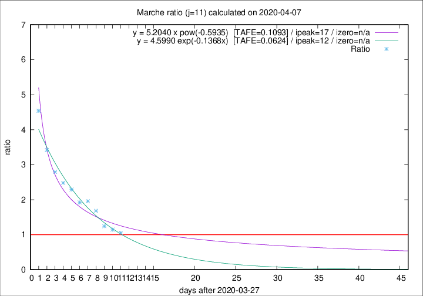

# Marche

Data source: https://raw.githubusercontent.com/pcm-dpc/COVID-19/master/dati-json/dpc-covid19-ita-regioni.json

Delta days analysis (j): 11

## Fitting 
|fit type|best fit equation|tafe|tfe|ipeak|izero|
|-------|-----|--------|------|---|---|
|exp|y = 4.5990 exp(-0.1368x)  [TAFE=0.0624]|0.0624|0.0026|12|n/a|
|pow|y = 5.2040 x pow(-0.5935)  [TAFE=0.1093]|0.1093|0.0074|17|n/a|

## Data
|Date|Daily deaths|Cumulated deaths|Deaths in the last 11 days|Deaths in the 11 days before|ratio|
|----|----------|-----------|-------|--------------------|-----|
|2020-04-07|18|630|294|279|1.0538|
|2020-04-06|13|612|302|264|1.1439|
|2020-04-05|25|599|312|251|1.2430|
|2020-04-04|17|574|343|204|1.6814|
|2020-04-03|54|557|354|181|1.9558|
|2020-04-02|26|503|319|166|1.9217|
|2020-04-01|25|477|323|141|2.2908|
|2020-03-31|35|452|315|127|2.4803|
|2020-03-30|31|417|302|108|2.7963|
|2020-03-29|22|386|294|86|3.4186|
|2020-03-28|28|364|295|65|4.5385|

[Download data as CSV](COVID-19_marche_j11_2020-04-07.csv)

Generated April 9th, 2020 at 16:40:48 UTC+0200 with https://github.com/robianc/COVID-19
