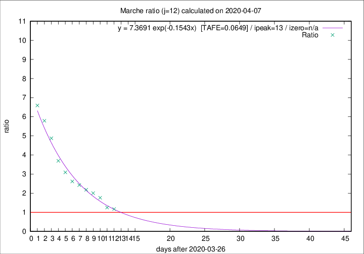

# Marche

Data source: https://raw.githubusercontent.com/pcm-dpc/COVID-19/master/dati-json/dpc-covid19-ita-regioni.json

Delta days analysis (j): 12

Analyses for other values of j for 2020-04-07 are avalable [here](../README.md)

Analyses for Marche for previous dates are avalable [here](../../README.md)

## Fitting 
|fit type|best fit equation|tafe|tfe|ipeak|izero|
|-------|-----|--------|------|---|---|
|exp|y = 7.3691 exp(-0.1543x)  [TAFE=0.0649]|0.0649|0.0029|13|n/a|

## Data
|Date|Daily deaths|Cumulated deaths|Deaths in the last 12 days|Deaths in the 12 days before|ratio|
|----|----------|-----------|-------|--------------------|-----|
|2020-04-07|18|630|320|274|1.1679|
|2020-04-06|13|612|325|260|1.2500|
|2020-04-05|25|599|368|209|1.7608|
|2020-04-04|17|574|371|185|2.0054|
|2020-04-03|54|557|373|171|2.1813|
|2020-04-02|26|503|349|144|2.4236|
|2020-04-01|25|477|340|130|2.6154|
|2020-03-31|35|452|337|109|3.0917|
|2020-03-30|31|417|325|88|3.6932|
|2020-03-29|22|386|317|65|4.8769|
|2020-03-28|28|364|307|53|5.7925|
|2020-03-27|26|336|290|44|6.5909|

[Download data as CSV](COVID-19_marche_j12_2020-04-07.csv)

Generated April 10th, 2020 at 17:26:10 UTC+0200 with https://github.com/robianc/COVID-19
