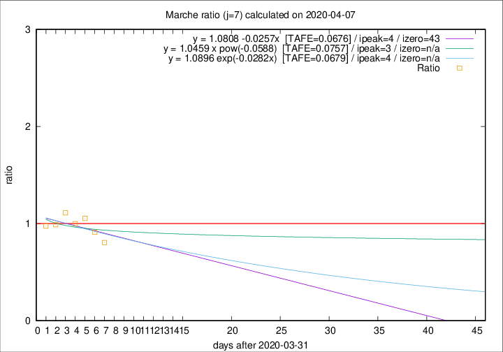

# Marche

Data source: https://raw.githubusercontent.com/pcm-dpc/COVID-19/master/dati-json/dpc-covid19-ita-regioni.json

Delta days analysis (j): 7

Analyses for other values of j for 2020-04-07 are avalable [here](../2020-04-07/README.md)

Analyses for Marche for previous dates are avalable [here](../README.md)

## Fitting 
|fit type|best fit equation|tafe|tfe|ipeak|izero|
|-------|-----|--------|------|---|---|
|linear|y = 1.0808 -0.0257x  [TAFE=0.0676]|0.0676|0.0062|4|43|
|exp|y = 1.0896 exp(-0.0282x)  [TAFE=0.0679]|0.0679|0.0029|4|n/a|
|pow|y = 1.0459 x pow(-0.0588)  [TAFE=0.0757]|0.0757|0.0041|3|n/a|

## Data
|Date|Daily deaths|Cumulated deaths|Deaths in the last 7 days|Deaths in the 7 days before|ratio|
|----|----------|-----------|-------|--------------------|-----|
|2020-04-07|18|630|178|221|0.8054|
|2020-04-06|13|612|195|214|0.9112|
|2020-04-05|25|599|213|202|1.0545|
|2020-04-04|17|574|210|210|1.0000|
|2020-04-03|54|557|221|199|1.1106|
|2020-04-02|26|503|193|195|0.9897|
|2020-04-01|25|477|190|195|0.9744|

[Download data as CSV](COVID-19_marche_j7_2020-04-07.csv)

Generated April 16th, 2020 at 20:09:19 UTC+0200 with https://github.com/robianc/COVID-19
