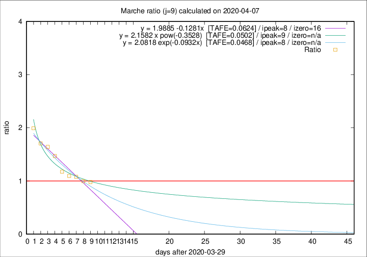

# Marche

Data source: https://raw.githubusercontent.com/pcm-dpc/COVID-19/master/dati-json/dpc-covid19-ita-regioni.json

Delta days analysis (j): 9

Analyses for other values of j for 2020-04-07 are avalable [here](../2020-04-07/README.md)

Analyses for Marche for previous dates are avalable [here](../README.md)

## Fitting 
|fit type|best fit equation|tafe|tfe|ipeak|izero|
|-------|-----|--------|------|---|---|
|linear|y = 1.9885 -0.1281x  [TAFE=0.0624]|0.0624|0.0028|8|16|
|exp|y = 2.0818 exp(-0.0932x)  [TAFE=0.0468]|0.0468|0.0015|8|n/a|
|pow|y = 2.1582 x pow(-0.3528)  [TAFE=0.0502]|0.0502|0.0020|9|n/a|

## Data
|Date|Daily deaths|Cumulated deaths|Deaths in the last 9 days|Deaths in the 9 days before|ratio|
|----|----------|-----------|-------|--------------------|-----|
|2020-04-07|18|630|244|249|0.9799|
|2020-04-06|13|612|248|249|0.9960|
|2020-04-05|25|599|263|244|1.0779|
|2020-04-04|17|574|264|241|1.0954|
|2020-04-03|54|557|270|230|1.1739|
|2020-04-02|26|503|272|185|1.4703|
|2020-04-01|25|477|274|167|1.6407|
|2020-03-31|35|452|268|157|1.7070|
|2020-03-30|31|417|263|132|1.9924|

[Download data as CSV](COVID-19_marche_j9_2020-04-07.csv)

Generated April 16th, 2020 at 20:09:19 UTC+0200 with https://github.com/robianc/COVID-19
