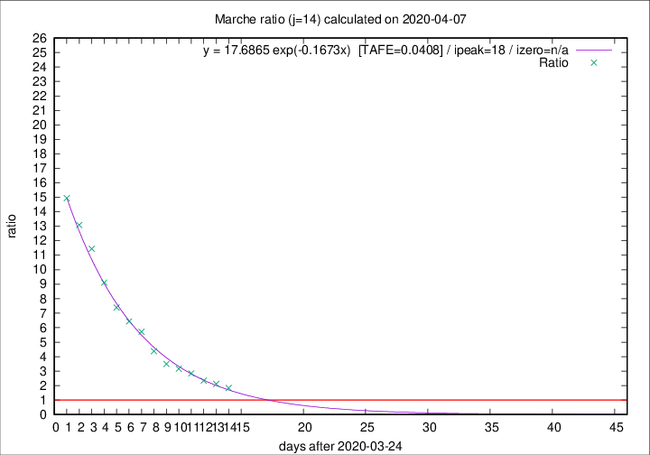
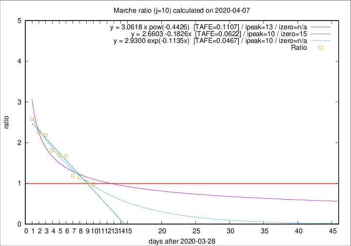

# Marche

Data source: https://raw.githubusercontent.com/pcm-dpc/COVID-19/master/dati-json/dpc-covid19-ita-regioni.json

Estimates in this page were made on 9/4/2020 with data available until 07/04/2020.

## Summary 

### Peak estimate 
|j|linear [TAFE]|exponential [TAFE]|power law [TAFE]|details|
|---|----|-----------|---------|-------|
|7|5/4/2020 [TAFE=0.0676]|5/4/2020 [TAFE=0.0679]|4/4/2020 [TAFE=0.0757]|[analysis](COVID-19_marche_j7_2020-04-07.md)|
|8|7/4/2020 [TAFE=0.0757]|7/4/2020 [TAFE=0.0659]|6/4/2020 [TAFE=0.0507]|[analysis](COVID-19_marche_j8_2020-04-07.md)|
|9|7/4/2020 [TAFE=0.0624]|7/4/2020 [TAFE=0.0468]|8/4/2020 [TAFE=0.0502]|[analysis](COVID-19_marche_j9_2020-04-07.md)|
|10|8/4/2020 [TAFE=0.0622]|8/4/2020 [TAFE=0.0467]|11/4/2020 [TAFE=0.1107]|[analysis](COVID-19_marche_j10_2020-04-07.md)|
|11|8/4/2020 [TAFE=0.1125]|9/4/2020 [TAFE=0.0624]|14/4/2020 [TAFE=0.1093]|[analysis](COVID-19_marche_j11_2020-04-07.md)|
|12|8/4/2020 [TAFE=0.1782]|9/4/2020 [TAFE=0.0649]|18/4/2020 [TAFE=0.1394]|[analysis](COVID-19_marche_j12_2020-04-07.md)|
|13|7/4/2020 [TAFE=0.2280]|10/4/2020 [TAFE=0.0535]|24/4/2020 [TAFE=0.1473]|[analysis](COVID-19_marche_j13_2020-04-07.md)|
|14|7/4/2020 [TAFE=0.2674]|12/4/2020 [TAFE=0.0408]|4/5/2020 [TAFE=0.1862]|[analysis](COVID-19_marche_j14_2020-04-07.md)|

Best estimator is exp with j=14 (TAFE=0.0408)
Corresponding peak date estimate is 12/4/2020 (ipeak 18)

Peak date range estimate: 28/3/2020 - 4/5/2020

### End estimate 
|j|linear [TAFE/TFE]|exponential [TAFE/TFE]|power law [TAFE/TFE]|details|
|---|----|-----------|---------|-------|
|7|14/5/2020 [TAFE=0.0676]|-|-|[analysis](COVID-19_marche_j7_2020-04-07.md)|
|8|-|-|-|[analysis](COVID-19_marche_j8_2020-04-07.md)|
|9|15/4/2020 [TAFE=0.0624]|-|-|[analysis](COVID-19_marche_j9_2020-04-07.md)|
|10|13/4/2020 [TAFE=0.0622]|-|-|[analysis](COVID-19_marche_j10_2020-04-07.md)|
|11|-|-|-|[analysis](COVID-19_marche_j11_2020-04-07.md)|
|12|-|-|-|[analysis](COVID-19_marche_j12_2020-04-07.md)|
|13|-|-|-|[analysis](COVID-19_marche_j13_2020-04-07.md)|
|14|-|-|-|[analysis](COVID-19_marche_j14_2020-04-07.md)|

Best estimator is linear with j=10 (TAFE=0.0622)
Corresponding end date estimate is 13/4/2020 (izero 15)

End date range estimate: 29/3/2020 - 11/5/2020

Generated April 9th, 2020 at 16:40:48 UTC+0200 with https://github.com/robianc/COVID-19
