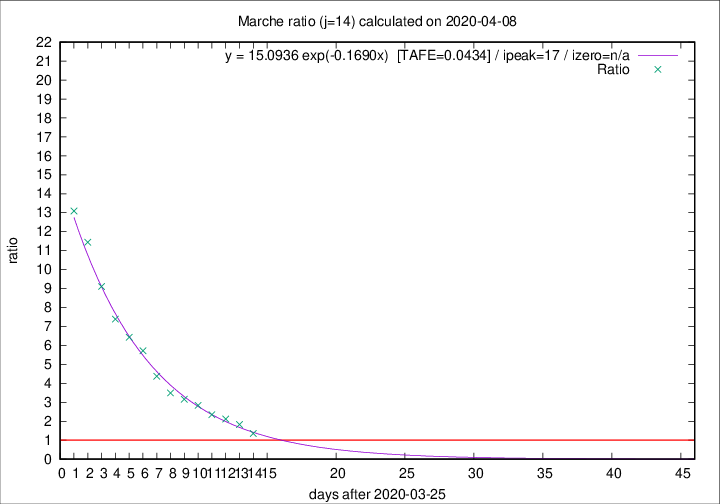
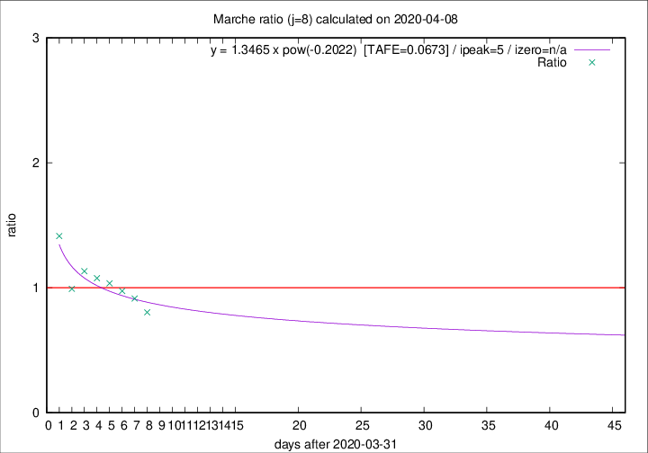

# Marche

Data source: https://raw.githubusercontent.com/pcm-dpc/COVID-19/master/dati-json/dpc-covid19-ita-regioni.json

Estimates in this page were made on 19/4/2020 with data available until 08/04/2020.

## Summary 

### Peak estimate 
|j|linear [TAFE]|exponential [TAFE]|power law [TAFE]|details|
|---|----|-----------|---------|-------|
|7|6/4/2020 [TAFE=0.0621]|5/4/2020 [TAFE=0.0618]|5/4/2020 [TAFE=0.0684]|[analysis](COVID-19_marche_j7_2020-04-08.md)|
|8|7/4/2020 [TAFE=0.0534]|7/4/2020 [TAFE=0.0588]|6/4/2020 [TAFE=0.0673]|[analysis](COVID-19_marche_j8_2020-04-08.md)|
|9|8/4/2020 [TAFE=0.0668]|8/4/2020 [TAFE=0.0503]|8/4/2020 [TAFE=0.0472]|[analysis](COVID-19_marche_j9_2020-04-08.md)|
|10|8/4/2020 [TAFE=0.0800]|8/4/2020 [TAFE=0.0582]|10/4/2020 [TAFE=0.0956]|[analysis](COVID-19_marche_j10_2020-04-08.md)|
|11|8/4/2020 [TAFE=0.0790]|9/4/2020 [TAFE=0.0493]|13/4/2020 [TAFE=0.1252]|[analysis](COVID-19_marche_j11_2020-04-08.md)|
|12|8/4/2020 [TAFE=0.1610]|10/4/2020 [TAFE=0.0675]|15/4/2020 [TAFE=0.1363]|[analysis](COVID-19_marche_j12_2020-04-08.md)|
|13|8/4/2020 [TAFE=0.2003]|11/4/2020 [TAFE=0.0536]|21/4/2020 [TAFE=0.1597]|[analysis](COVID-19_marche_j13_2020-04-08.md)|
|14|8/4/2020 [TAFE=0.2780]|12/4/2020 [TAFE=0.0434]|27/4/2020 [TAFE=0.1806]|[analysis](COVID-19_marche_j14_2020-04-08.md)|

Best estimator is exp with j=14 (TAFE=0.0434)
Corresponding peak date estimate is 12/4/2020 (ipeak 17)

Peak date range estimate: 29/3/2020 - 27/4/2020

### End estimate 
|j|linear [TAFE/TFE]|exponential [TAFE/TFE]|power law [TAFE/TFE]|details|
|---|----|-----------|---------|-------|
|7|7/5/2020 [TAFE=0.0621]|-|-|[analysis](COVID-19_marche_j7_2020-04-08.md)|
|8|23/4/2020 [TAFE=0.0534]|-|-|[analysis](COVID-19_marche_j8_2020-04-08.md)|
|9|-|-|-|[analysis](COVID-19_marche_j9_2020-04-08.md)|
|10|-|-|-|[analysis](COVID-19_marche_j10_2020-04-08.md)|
|11|-|-|-|[analysis](COVID-19_marche_j11_2020-04-08.md)|
|12|-|-|-|[analysis](COVID-19_marche_j12_2020-04-08.md)|
|13|-|-|-|[analysis](COVID-19_marche_j13_2020-04-08.md)|
|14|-|-|-|[analysis](COVID-19_marche_j14_2020-04-08.md)|

Best estimator is linear with j=8 (TAFE=0.0534)
Corresponding end date estimate is 23/4/2020 (izero 22)

End date range estimate: 1/4/2020 - 6/5/2020

Generated April 19th, 2020 at 18:42:39 UTC+0200 with https://github.com/robianc/COVID-19
