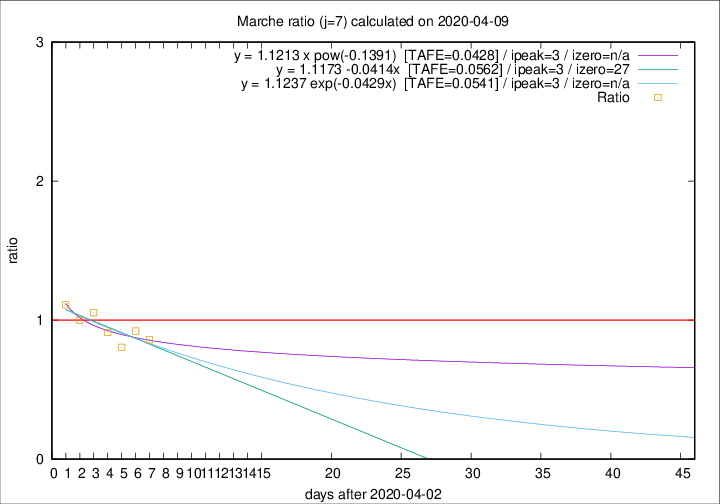

# Marche

Data source: https://raw.githubusercontent.com/pcm-dpc/COVID-19/master/dati-json/dpc-covid19-ita-regioni.json

Delta days analysis (j): 7

Analyses for other values of j for 2020-04-09 are avalable [here](../2020-04-09/README.md)

Analyses for Marche for previous dates are avalable [here](../README.md)

## Fitting 
|fit type|best fit equation|tafe|tfe|ipeak|izero|
|-------|-----|--------|------|---|---|
|linear|y = 1.1173 -0.0414x  [TAFE=0.0562]|0.0562|0.0036|3|27|
|exp|y = 1.1237 exp(-0.0429x)  [TAFE=0.0541]|0.0541|0.0018|3|n/a|
|pow|y = 1.1213 x pow(-0.1391)  [TAFE=0.0428]|0.0428|0.0017|3|n/a|

## Data
|Date|Daily deaths|Cumulated deaths|Deaths in the last 7 days|Deaths in the 7 days before|ratio|
|----|----------|-----------|-------|--------------------|-----|
|2020-04-09|17|669|166|193|0.8601|
|2020-04-08|22|652|175|190|0.9211|
|2020-04-07|18|630|178|221|0.8054|
|2020-04-06|13|612|195|214|0.9112|
|2020-04-05|25|599|213|202|1.0545|
|2020-04-04|17|574|210|210|1.0000|
|2020-04-03|54|557|221|199|1.1106|

[Download data as CSV](COVID-19_marche_j7_2020-04-09.csv)

Generated April 19th, 2020 at 18:42:39 UTC+0200 with https://github.com/robianc/COVID-19
