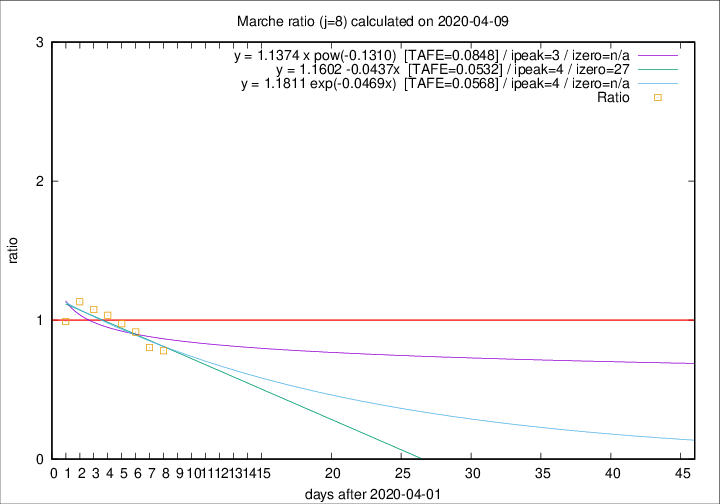

# Marche

Data source: https://raw.githubusercontent.com/pcm-dpc/COVID-19/master/dati-json/dpc-covid19-ita-regioni.json

Delta days analysis (j): 8

Analyses for other values of j for 2020-04-09 are avalable [here](../README.md)

Analyses for Marche for previous dates are avalable [here](../../README.md)

## Fitting 
|fit type|best fit equation|tafe|tfe|ipeak|izero|
|-------|-----|--------|------|---|---|
|linear|y = 1.1602 -0.0437x  [TAFE=0.0532]|0.0532|0.0040|4|27|
|exp|y = 1.1811 exp(-0.0469x)  [TAFE=0.0568]|0.0568|0.0022|4|n/a|
|pow|y = 1.1374 x pow(-0.1310)  [TAFE=0.0848]|0.0848|0.0040|3|n/a|

## Data
|Date|Daily deaths|Cumulated deaths|Deaths in the last 8 days|Deaths in the 8 days before|ratio|
|----|----------|-----------|-------|--------------------|-----|
|2020-04-09|17|669|192|246|0.7805|
|2020-04-08|22|652|200|249|0.8032|
|2020-04-07|18|630|213|233|0.9142|
|2020-04-06|13|612|226|232|0.9741|
|2020-04-05|25|599|235|227|1.0352|
|2020-04-04|17|574|238|221|1.0769|
|2020-04-03|54|557|247|218|1.1330|
|2020-04-02|26|503|216|218|0.9908|

[Download data as CSV](COVID-19_marche_j8_2020-04-09.csv)

Generated April 12th, 2020 at 16:28:18 UTC+0200 with https://github.com/robianc/COVID-19
