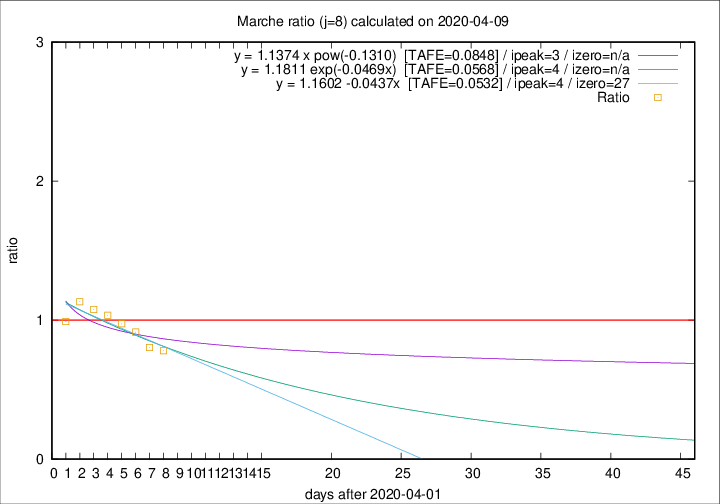

# Marche

Data source: https://raw.githubusercontent.com/pcm-dpc/COVID-19/master/dati-json/dpc-covid19-ita-regioni.json

Estimates in this page were made on 16/4/2020 with data available until 09/04/2020.

## Summary 

### Peak estimate 
|j|linear [TAFE]|exponential [TAFE]|power law [TAFE]|details|
|---|----|-----------|---------|-------|
|7|6/4/2020 [TAFE=0.0562]|6/4/2020 [TAFE=0.0541]|6/4/2020 [TAFE=0.0428]|[analysis](COVID-19_marche_j7_2020-04-09.md)|
|8|6/4/2020 [TAFE=0.0532]|6/4/2020 [TAFE=0.0568]|5/4/2020 [TAFE=0.0848]|[analysis](COVID-19_marche_j8_2020-04-09.md)|
|9|8/4/2020 [TAFE=0.0667]|8/4/2020 [TAFE=0.0489]|7/4/2020 [TAFE=0.0361]|[analysis](COVID-19_marche_j9_2020-04-09.md)|
|10|9/4/2020 [TAFE=0.0954]|9/4/2020 [TAFE=0.0700]|9/4/2020 [TAFE=0.0596]|[analysis](COVID-19_marche_j10_2020-04-09.md)|
|11|9/4/2020 [TAFE=0.0814]|9/4/2020 [TAFE=0.0541]|12/4/2020 [TAFE=0.1173]|[analysis](COVID-19_marche_j11_2020-04-09.md)|
|12|9/4/2020 [TAFE=0.1322]|10/4/2020 [TAFE=0.0605]|14/4/2020 [TAFE=0.1310]|[analysis](COVID-19_marche_j12_2020-04-09.md)|
|13|9/4/2020 [TAFE=0.1886]|11/4/2020 [TAFE=0.0584]|18/4/2020 [TAFE=0.1631]|[analysis](COVID-19_marche_j13_2020-04-09.md)|
|14|9/4/2020 [TAFE=0.2688]|12/4/2020 [TAFE=0.0441]|23/4/2020 [TAFE=0.1731]|[analysis](COVID-19_marche_j14_2020-04-09.md)|

Best estimator is pow with j=9 (TAFE=0.0361)
Corresponding peak date estimate is 7/4/2020 (ipeak 6)

Peak date range estimate: 4/4/2020 - 28/4/2020

### End estimate 
|j|linear [TAFE/TFE]|exponential [TAFE/TFE]|power law [TAFE/TFE]|details|
|---|----|-----------|---------|-------|
|7|30/4/2020 [TAFE=0.0562]|-|-|[analysis](COVID-19_marche_j7_2020-04-09.md)|
|8|29/4/2020 [TAFE=0.0532]|-|-|[analysis](COVID-19_marche_j8_2020-04-09.md)|
|9|-|-|-|[analysis](COVID-19_marche_j9_2020-04-09.md)|
|10|-|-|-|[analysis](COVID-19_marche_j10_2020-04-09.md)|
|11|-|-|-|[analysis](COVID-19_marche_j11_2020-04-09.md)|
|12|-|-|-|[analysis](COVID-19_marche_j12_2020-04-09.md)|
|13|-|-|-|[analysis](COVID-19_marche_j13_2020-04-09.md)|
|14|-|-|-|[analysis](COVID-19_marche_j14_2020-04-09.md)|

Best estimator is linear with j=8 (TAFE=0.0532)
Corresponding end date estimate is 29/4/2020 (izero 27)

End date range estimate: 2/4/2020 - 29/4/2020

Generated April 16th, 2020 at 20:09:19 UTC+0200 with https://github.com/robianc/COVID-19
